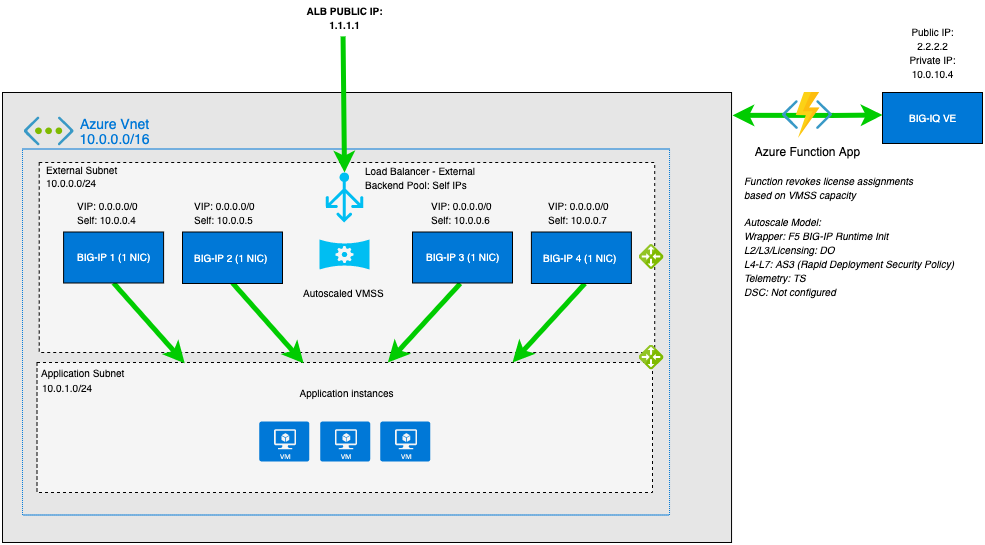

# Deploying the BIG-IP VE in Azure - Example Autoscale BIG-IP WAF (LTM + ASM) - Virtual Machine Scale Set (Frontend via ALB) - BIG-IQ Licensing

[](https://github.com/f5networks/f5-azure-arm-templates-v2/releases)
[](https://github.com/f5networks/f5-azure-arm-templates-v2/issues)

## Contents

  - [Contents](#contents)
  - [Introduction](#introduction)
  - [Diagram](#diagram)
  - [Prerequisites](#prerequisites)
  - [Important Configuration Notes](#important-configuration-notes)
    - [Template Input Parameters](#template-input-parameters)
    - [Template Outputs](#template-outputs)
  - [Deploying this Solution](#deploying-this-solution)
    - [Deploying via the Azure Deploy Button](#deploying-via-the-azure-deploy-button)
    - [Deploying via the Azure CLI](#deploying-via-the-azure-cli)
    - [Changing the BIG-IP Deployment](#changing-the-big-ip-deployment)
  - [Validation](#validation)
    - [Validating the Deployment](#validating-the-deployment)
    - [Testing the WAF Service](#testing-the-waf-service)
    - [Viewing the Azure Workbook in Azure Log Analytics Workspace](#viewing-the-azure-workbook-in-azure-log-analytics-workspace)
  - [Updating this Solution](#updating-this-solution)
    - [Updating the Configuration](#updating-the-configuration)
    - [Upgrading the BIG-IP VE Image](#upgrading-the-big-ip-ve-image)
  - [Deleting this Solution](#deleting-this-solution)
  - [Troubleshooting Steps](#troubleshooting-steps)
  - [Security](#security)
  - [BIG-IP versions](#big-ip-versions)
  - [Resource Creation Flow Chart](#resource-creation-flow-chart)
  - [Documentation](#documentation)
  - [Getting Help](#getting-help)
    - [Filing Issues](#filing-issues)


## Introduction

This solution uses a parent template to launch several linked child templates (modules) to create an example BIG-IP autoscale solution. The linked templates are located in the [`examples/modules`](https://github.com/F5Networks/f5-azure-arm-templates-v2/tree/main/examples/modules) directory in this repository. **F5 recommends cloning this repository and modifying these templates to fit your use case.** 

***Full Stack (azuredeploy.json)***<br>
Use the *azuredeploy.json* parent template to deploy an example full stack autoscale solution, complete with virtual network, bastion *(optional)*, dag/ingress, access, BIG-IP(s), telemetry destination and example web application.  

***Existing Network Stack (azuredeploy-existing-network.json)***<br>
Use azuredeploy-existing-network.json parent template to deploy the autoscale solution into an existing infrastructure. This template expects the virtual network, subnets, and bastion host(s) have already been deployed. The example web application is also not part of this parent template as it intended for an existing environment.

The modules below create the following cloud resources:

- **Network**: This template creates Azure Virtual Networks, Subnets, and Route Tables. *(Full stack only)*
- **Application**: This template creates a generic example application for use when demonstrating live traffic through the BIG-IPs.*(Full stack only)*
- **Bastion**: This template creates a generic example bastion for use when connecting to the management interfaces of BIG-IPs. *(Full stack only)*
- **Disaggregation** *(DAG/Ingress)*: This template creates resources required to get traffic to the BIG-IP, including Azure Network Security Groups, Public IP Addresses, internal/external Load Balancers, and accompanying resources such as load balancing rules, NAT rules, and probes.
- **Access**: This template creates an Azure Managed User Identity, KeyVault, and secret used to set the admin password on the BIG-IP instances.
- **BIG-IP**: This template creates the Microsoft Azure Virtual Machine Scale Set with F5 BIG-IP Virtual Editions provisioned with Local Traffic Manager (LTM) and Application Security Manager (ASM). Traffic flows from the Azure load balancer to the BIG-IP VE instances and then to the application servers. The BIG-IP VE(s) are configured in single-NIC mode. Auto scaling means that as certain thresholds are reached, the number of BIG-IP VE instances automatically increases or decreases accordingly. The BIG-IP module template can be deployed separately from the example template provided here into an "existing" stack.
- **Telemetry**: This template creates resources to support sending metrics and remote logging (for example, an Azure Log Analytics Workspace and Workbook). 
- **Function**: This template creates an Azure Function and associated resources for revoking license assignments from the BIG-IQ device when an autoscaled BIG-IP instance is deleted.


This solution leverages more traditional Autoscale configuration management practices where each instance is created with an identical configuration as defined in the Scale Set's "model". Scale Set sizes are no longer restricted to the small limitations of the cluster. The BIG-IP's configuration, now defined in a single convenient YAML or JSON [F5 BIG-IP Runtime Init](https://github.com/F5Networks/f5-bigip-runtime-init) configuration file, leverages [F5 Automation Tool Chain](https://www.f5.com/pdf/products/automation-toolchain-overview.pdf) declarations which are easier to author, validate and maintain as code. For instance, if you need to change the configuration on the BIG-IPs in the deployment, instead of updating the existing instances directly, you update the instance model by passing a new config file (which references the updated Automation Toolchain declarations) via template's bigIpRuntimeInitConfig input parameter. The model will be responsible for maintaining the configuration across the deployment, updating existing instances and deploying new instances with the latest configuration.


## Diagram



## Prerequisites

  - This solution requires an Azure account that can provision objects described in the solution and [resource group](https://docs.microsoft.com/en-us/azure/azure-resource-manager/management/manage-resource-groups-portal#create-resource-groups).
    - Azure Portal: [Create a Resource Group](https://docs.microsoft.com/en-us/azure/azure-resource-manager/management/manage-resource-groups-portal#create-resource-groups)
    - Azure CLI: 
      ```bash
      az group create -n ${RESOURCE_GROUP} -l ${REGION}
      ```
  - A location to host your custom BIG-IP config (runtime-init.conf) with your Azure Vault, BIG-IQ LM and logging information. See [Changing the BIG-IP Deployment](#changing-the-big-ip-deployment) for customization details.
  - This solution requires an Azure Key Vault and secret containing the password to access the BIG-IQ License Manager provided in the format https://yourvaultname.vault.azure.net/secrets/yoursecretid or https://yourvaultname.vault.azure.net/secrets/yoursecretid/yoursecretversion. 

    For example, to create the secret using the Azure CLI:
      ```bash
      az keyvault create --name [YOUR_VAULT_NAME] --resource-group [YOUR_RESOURCE_GROUP] --location [YOUR_REGION]
    az keyvault secret set --vault-name [YOUR_VAULT_NAME] --name [YOUR_SECRET_ID] --value "[YOUR_BIGIQ_PASSWORD]"
      ```
      - *NOTE:*
        - Vault names in Azure are DNS based and hence globally unique.
        - The Vault can be in a different resource group than the BIG-IP resource group.
        - The user or service principal deploying the template must have `Key Vault Contributor` role in order for the Access template to create an Access Policy for the secret. For more information, see Azure [Docs](https://docs.microsoft.com/en-us/azure/key-vault/general/rbac-guide?tabs=azure-cli#azure-built-in-roles-for-key-vault-data-plane-operations)
  - This solution requires an [SSH key](https://docs.microsoft.com/en-us/azure/virtual-machines/ssh-keys-portal) for access to the BIG-IP instances. For more information about creating a key pair for use in Azure, see Azure SSH key [documentation](https://docs.microsoft.com/en-us/azure/virtual-machines/linux/mac-create-ssh-keys).
  - This solution requires you to accept any Azure Marketplace "License/Terms and Conditions" for the images used in this solution.
    - By default, this solution uses [F5 BIG-IP VE – ALL (BYOL, 2 Boot Locations)](https://azuremarketplace.microsoft.com/en-us/marketplace/apps/f5-networks.f5-big-ip-byol?tab=PlansAndPrice)
    - Azure CLI: 
      ```bash
      az vm image terms accept --publisher f5-networks --offer f5-big-ip-best --plan f5-big-best-plus-hourly-25mbps
      ```
    - For more marketplace terms information, see Azure [documentation](https://docs.microsoft.com/en-us/azure/virtual-machines/linux/cli-ps-findimage#deploy-an-image-with-marketplace-terms). 
  - A BIG-IQ w/ License Manager (LM) configured with a valid license pool that is reachable by the BIG-IPs. See [documentation](https://support.f5.com/csp/article/K77706009) for more details. ***NOTE: For this example solution, reachable implies the BIG-IQ LM has a Public IP and is reachable over the Internet. However, in a production deployment, the BIG-IQ would be internally routable (for example, shared services VPC, VPN, etc.) ***
  - A remote log destination pre-provisioned.
    - By default, this solution uses Telemetry Streaming to log to [Azure Log Analytics](https://docs.microsoft.com/en-us/azure/azure-monitor/logs/quick-create-workspace-cli).
        - Azure Portal: [Create a Workspace](https://docs.microsoft.com/en-us/azure/azure-monitor/logs/quick-create-workspace) 
        - Azure CLI: [Create a Workspace](https://docs.microsoft.com/en-us/azure/azure-monitor/logs/quick-create-workspace-cli)
          ```bash
          az deployment group create --resource-group ${RESOURCE_GROUP} --name ${WORKSPACE_DEPLOYMENT_NAME} --template-file deploylaworkspacetemplate.json
          ```
            - Provide a workspace name at prompt 
            - Obtain the **workspaceId** used by Telemetry Streaming configuration for that workspace:
            ```bash 
            az monitor log-analytics workspace show --resource-group ${RESOURCE_GROUP} --workspace-name ${YOUR_WORKSPACE_NAME} --query customerId
            ```
      - *NOTE: If the destination above does not exist, the solution will deploy but BIG-IP's Telemetry Streaming will complain* ***vigorously*** 
    - See Azure's [documentation](https://docs.microsoft.com/en-us/azure/azure-monitor/logs/data-platform-logs) for more information and [Changing the BIG-IP Deployment](#remote-logging) for customization details.

## Important Configuration Notes

- By default, this solution does not create a custom BIG-IP WebUI user as instances are not intended to be managed directly. However, an sshKey is installed to provide CLI access for demonstration and debugging purposes. 
  -  **Disclaimer:** ***Accessing or logging into the instances themselves is for demonstration and debugging purposes only. All configuration changes should be applied by updating the model via the template instead.***
  - See [Changing the BIG-IP Deployment](#changing-the-big-ip-deployment) for more details.

- This solution requires Internet access for: 
  1. Downloading additional F5 software components used for onboarding and configuring the BIG-IP (via GitHub.com). *NOTE: access via web proxy is not currently supported. Other options include 1) hosting the file locally and modifying the runtime-init package URL and configuration files to point to local URLs instead or 2) baking them into a custom image (BYOL images only), using the [F5 Image Generation Tool](https://clouddocs.f5.com/cloud/public/v1/ve-image-gen_index.html).*
  2. Contacting native cloud services for various cloud integrations: 
    - *Onboarding*:
        - [F5 BIG-IP Runtime Init](https://github.com/f5networks/f5-bigip-runtime-init) - to fetch secrets from native vault services
    - *Operation*:
        - [F5 Application Services 3](https://clouddocs.f5.com/products/extensions/f5-appsvcs-extension/latest/) - for features like Service Discovery
        - [F5 Telemetry Streaming](https://clouddocs.f5.com/products/extensions/f5-telemetry-streaming/latest/) - for logging and reporting
    - Additional cloud services like [Private endpoints](https://docs.microsoft.com/en-us/azure/storage/common/storage-private-endpoints#connecting-to-private-endpoints) can be used to address calls to native services traversing the Internet.
  - See [Security](#security) section for more details. 

- F5 ARM templates do not reconfigure existing Azure resources, such as network security groups. Depending on your configuration, you may need to configure these resources to allow the BIG-IP VE(s) to receive traffic for your application. Similarly, the DAG example template that deploys Azure Load Balancer(s) configures load balancing rules and probes on those resources to forward external traffic to the BIG-IP(s) on standard ports 443 and 80. F5 recommends cloning this repository and modifying the module templates to fit your use case.

- If you have cloned this repository to modify the templates or BIG-IP config files and published to your own location, you can use the **templateBaseUrl** and **artifactLocation** input parameters to specify the new location of the customized templates and the **bigIpRuntimeInitConfig** input parameter to specify the new location of the BIG-IP Runtime-Init config. See main [/examples/README.md](../../README.md#cloud-configuration) for more template customization details. See [Changing the BIG-IP Deployment](#changing-the-big-ip-deployment) for more BIG-IP customization details.

- In this solution, the BIG-IP VE has the [LTM](https://f5.com/products/big-ip/local-traffic-manager-ltm) and [ASM](https://f5.com/products/big-ip/application-security-manager-asm) modules enabled to provide advanced traffic management and web application security functionality. 

- If you are deploying the solution into an Azure region that supports Availability Zones, you can specify True for the useAvailabilityZones parameter. See [Azure Availability Zones](https://docs.microsoft.com/en-us/azure/availability-zones/az-region#azure-regions-with-availability-zones) for a list of regions that support Availability Zones.

- This template can send non-identifiable statistical information to F5 Networks to help us improve our templates. You can disable this functionality by setting the **autoPhonehome** system class property value to false in the F5 Declarative Onboarding declaration. See [Sending statistical information to F5](#sending-statistical-information-to-f5).

- See [trouble shooting steps](#troubleshooting-steps) for more details.


### Template Input Parameters

**Required** means user input is required because there is no default value or an empty string is not allowed. If no value is provided, the template will fail to launch. In some cases, the default value may only work on the first deployment due to creating a resource in a global namespace and customization is recommended. See the Description for more details.

| Parameter | Required | Default | Type | Description |
| --- | --- | --- | --- | --- |
| appContainerName | No | "f5devcentral/f5-demo-app:latest" | string | The name of a container to download and install which is used for the example application server. If this value is left blank, the application module template is not deployed. |
| appScalingMaxSize | No | 10 | integer | Maximum number of application instances (2-100) that can be created in the Autoscale Group. |
| appScalingMinSize | No | 1 | integer | Minimum number of application instances (1-99) you want available in the Autoscale Group. |
| artifactLocation | No | "f5-azure-arm-templates-v2/v2.0.0.0/examples/" | string | The directory, relative to the templateBaseUrl, where the modules folder is located. |
| bigIpImage | No | "f5-networks:f5-big-ip-byol:f5-big-all-2slot-byol:16.1.202000" | string | Two formats accepted. `URN` of the image to use in Azure marketplace or `ID` of custom image. Example URN value: `f5-networks:f5-big-ip-byol:f5-big-all-2slot-byol:16.0.101000`. You can find the URNs of F5 marketplace images in the README for this template or by running the command: `az vm image list --output yaml --publisher f5-networks --all`. See https://clouddocs.f5.com/cloud/public/v1/azure/Azure_download.html for information on creating custom BIG-IP image. |
| bigIpInstanceType | No | "Standard_D2s_v4" | string | Enter a valid instance type. |
| bigIpMaxBatchInstancePercent | No | 20 | integer | The maximum percentage of total virtual machine instances that will be upgraded simultaneously by the rolling upgrade in one batch. |
| bigIpMaxUnhealthyInstancePercent | No | 20 | integer | The maximum percentage of the total virtual machine instances in the scale set that can be simultaneously unhealthy. |
| bigIpMaxUnhealthyUpgradedInstancePercent | No | 20 | integer | The maximum percentage of upgraded virtual machine instances that can be found to be in an unhealthy state. |
| bigIpPauseTimeBetweenBatches | No | 0 | integer | The wait time between completing the update for all virtual machines in one batch and starting the next batch. |
| bigIpRuntimeInitConfig | No | https://raw.githubusercontent.com/F5Networks/f5-azure-arm-templates-v2/v2.0.0.0/examples/autoscale/bigip-configurations/runtime-init-conf-bigiq-with-app.yaml | string | Supply a URL to the bigip-runtime-init configuration file in YAML or JSON format, or an escaped JSON string to use for f5-bigip-runtime-init configuration. |
| bigIpRuntimeInitPackageUrl | No | https://cdn.f5.com/product/cloudsolutions/f5-bigip-runtime-init/v1.4.1/dist/f5-bigip-runtime-init-1.4.1-1.gz.run | string | Supply a URL to the bigip-runtime-init package. |
| bigIpScalingMaxSize | No | 10 | integer | Maximum number of BIG-IP instances (2-100) that can be created in the Autoscale Group. |
| bigIpScalingMinSize | No | 1 | integer | Minimum number of BIG-IP instances (1-99) you want available in the Autoscale Group. |
| bigIpScaleInCpuThreshold | No | 20 | integer | The percentage of CPU utilization that should trigger a scale in event. |
| bigIpScaleInThroughputThreshold | No | 10000000 | integer | The amount of throughput (**bytes**) that should trigger a scale in event. Note: The default value is equal to 10 MB. |
| bigIpScaleInTimeWindow | No | 10 | integer | The time window required to trigger a scale in event. This is used to determine the amount of time needed for a threshold to be breached, as well as to prevent excessive scaling events (flapping). **Note:** Allowed values are 1-60 (minutes). |
| bigIpScaleOutCpuThreshold | No | 80 | integer | The percentage of CPU utilization that should trigger a scale out event. |
| bigIpScaleOutThroughputThreshold | No | 20000000 | integer | The amount of throughput (**bytes**) that should trigger a scale out event. Note: The default value is equal to 20 MB. |
| bigIpScaleOutTimeWindow | No | 10 | integer | The time window required to trigger a scale out event. This is used to determine the amount of time needed for a threshold to be breached, as well as to prevent excessive scaling events (flapping). **Note:** Allowed values are 1-60 (minutes). |
| bigIqVnetId | No |  | string | The fully-qualified Azure resource ID of the virtual network where BIG-IQ is deployed. This is required to allow inbound communication from the Azure license revocation function and the BIG-IQ device. Leave the default value if the BIG-IQ device uses a public IP address for licensing. |
| createWorkspace | No | true | boolean | This deployment will create a workspace and workbook as part of the Telemetry module, intended for enabling Remote Logging using Azure Log Workspace. |
| provisionExternalBigIpLoadBalancer | No | true| boolean | Select true if you would like to provision an external Azure load balancer. |
| provisionInternalBigIpLoadBalancer | No | false | boolean | Select true if you would like to provision an internal Azure load balancer. |
| provisionPublicIp | No | true | boolean | Select true if you would like to provision a public IP address for accessing the BIG-IP instance(s). |
| restrictedSrcAddressMgmt | Yes |  | string | An IP address or address range (in CIDR notation) used to restrict SSH and management GUI access to the BIG-IP Management or bastion host instances. **Important**: The VPC CIDR is automatically added for internal use (access via bastion host, clustering, etc.). Please do NOT use "0.0.0.0/0". Instead, restrict the IP address range to your client or trusted network, for example "55.55.55.55/32". Production should never expose the BIG-IP Management interface to the Internet. |
| restrictedSrcAddressApp | Yes |  | string | An IP address range (CIDR) that can be used to restrict access web traffic (80/443) to the BIG-IP instances, for example 'X.X.X.X/32' for a host, '0.0.0.0/0' for the Internet, etc. **NOTE**: The VPC CIDR is automatically added for internal use. |
| secretId | Yes |  | string | The full URL of the secretId where the BIG-IQ password is stored, including KeyVault Name. For example: https://yourvaultname.vault.azure.net/secrets/yoursecretid. This will be used by the revoke function as well as the BIG-IP to manage the License lifecycle of the device. |
| sshKey | Yes |  | string | Supply the public key that will be used for SSH authentication to the BIG-IP and application virtual machines. Note: This should be the public key as a string, typically starting with **ssh-rsa**. |
| tagValues | No | "application": "APP", "cost": "COST", "environment": "ENV", "group": "GROUP", "owner": "OWNER" | object | Default key/value resource tags will be added to the resources in this deployment. If you would like the values to be unique adjust them as needed for each key. |
| templateBaseUrl | No | https://cdn.f5.com/product/cloudsolutions/ | string | The publicly accessible URL where the linked ARM templates are located. |
| uniqueString | Yes |  | string | A prefix that will be used to name template resources. Because some resources require globally unique names, we recommend using a unique value. |
| useAvailabilityZones | No | false | boolean | This deployment can deploy resources into Azure Availability Zones (if the region supports it). If that is not desired the input should be set false. If the region does not support availability zones the input should be set to false. |
| workspaceId | No | "WORKSPACE_ID" | string | Azure Logging Workspace ID. for example, "0ad61913-8c82-4d58-b93c-89d612812c84" |

### Template Outputs

| Name | Required Resource | Type | Description |
| --- | --- | --- | --- |
| appUsername | Application Template | string | Application username | Application Template |
| appVmssName | Application Template | string | Application Virtual Machine Scale Set name |
| appVmssId | Application Template | string | Application Virtual Machine Scale Set resource ID |
| bigIpUsername | BIG-IP Template | string | BIG-IP username |
| virtualNetworkId | Network Template | string | Virtual Network resource ID |
| bastionVmssName | Bastion Template | string | Bastion Virtual Machine Scale Set name |
| bastionVmssId | Bastion Template | string | Bastion Virtual Machine Scale Set resource ID |
| bigIpVmssId | BIG-IP Template | string | BIG-IP Virtual Machine Scale Set resource ID |
| bigIpVmssName | BIG-IP Template | string | BIG-IP Virtual Machine Scale Set name|
| wafPublicIps | DAG Template | array | WAF Service Public IP Addresses |
| wafPrivateIp | DAG Template | array | WAF Service Private IP Addresses |


### Existing Network Template Input Parameters

| Parameter | Required | Default | Type | Description |
| --- | --- | --- | --- | --- |
| artifactLocation | No | "f5-azure-arm-templates-v2/v2.0.0.0/examples/" | string | The directory, relative to the templateBaseUrl, where the modules folder is located. |
| bigIpImage | No | "f5-networks:f5-big-ip-byol:f5-big-all-2slot-byol:16.1.202000" | string | Two formats accepted. `URN` of the image to use in Azure marketplace or `ID` of custom image. Example URN value: `f5-networks:f5-big-ip-byol:f5-big-all-2slot-byol:16.0.101000`. You can find the URNs of F5 marketplace images in the README for this template or by running the command: `az vm image list --output yaml --publisher f5-networks --all`. See https://clouddocs.f5.com/cloud/public/v1/azure/Azure_download.html for information on creating custom BIG-IP image. |
| bigIpInstanceType | No | "Standard_D2s_v4" | string | Enter a valid instance type. |
| bigIpMaxBatchInstancePercent | No | 20 | integer | The maximum percentage of total virtual machine instances that will be upgraded simultaneously by the rolling upgrade in one batch. |
| bigIpMaxUnhealthyInstancePercent | No | 20 | integer | The maximum percentage of the total virtual machine instances in the scale set that can be simultaneously unhealthy. |
| bigIpMaxUnhealthyUpgradedInstancePercent | No | 20 | integer | The maximum percentage of upgraded virtual machine instances that can be found to be in an unhealthy state. |
| bigIpPauseTimeBetweenBatches | No | 0 | integer | The wait time between completing the update for all virtual machines in one batch and starting the next batch. |
| bigIpRuntimeInitConfig | No | https://raw.githubusercontent.com/F5Networks/f5-azure-arm-templates-v2/v2.0.0.0/examples/autoscale/bigip-configurations/runtime-init-conf-bigiq.yaml | string | Supply a URL to the bigip-runtime-init configuration file in YAML or JSON format, or an escaped JSON string to use for f5-bigip-runtime-init configuration. |
| bigIpRuntimeInitPackageUrl | No | https://cdn.f5.com/product/cloudsolutions/f5-bigip-runtime-init/v1.4.1/dist/f5-bigip-runtime-init-1.4.1-1.gz.run | string | Supply a URL to the bigip-runtime-init package. |
| bigIpScalingMaxSize | No | 10 | integer | Maximum number of BIG-IP instances (2-100) that can be created in the Autoscale Group. |
| bigIpScalingMinSize | No | 1 | integer | Minimum number of BIG-IP instances (1-99) you want available in the Autoscale Group. |
| bigIpScaleInCpuThreshold | No | 20 | integer | The percentage of CPU utilization that should trigger a scale in event. |
| bigIpScaleInThroughputThreshold | No | 10000000 | integer | The amount of throughput (**bytes**) that should trigger a scale in event. Note: The default value is equal to 10 MB. |
| bigIpScaleInTimeWindow | No | 10 | integer | The time window required to trigger a scale in event. This is used to determine the amount of time needed for a threshold to be breached, as well as to prevent excessive scaling events (flapping). **Note:** Allowed values are 1-60 (minutes). |
| bigIpScaleOutCpuThreshold | No | 80 | integer | The percentage of CPU utilization that should trigger a scale out event. |
| bigIpScaleOutThroughputThreshold | No | 20000000 | integer | The amount of throughput (**bytes**) that should trigger a scale out event. Note: The default value is equal to 20 MB. |
| bigIpScaleOutTimeWindow | No | 10 | integer | The time window required to trigger a scale out event. This is used to determine the amount of time needed for a threshold to be breached, as well as to prevent excessive scaling events (flapping). **Note:** Allowed values are 1-60 (minutes). |
| bigIqVnetId | No |  | string | The fully-qualified Azure resource ID of the virtual network where BIG-IQ is deployed. This is required to allow inbound communication from the Azure license revocation function and the BIG-IQ device. Leave the default value if the BIG-IQ device uses a public IP address for licensing. |
| createWorkspace | No | True | boolean | This deployment will create a workspace and workbook as part of the Telemetry module, intended for enabling Remote Logging using Azure Log Workspace. |
| provisionExternalBigIpLoadBalancer | No | true | boolean | Select true if you would like to provision an external Azure load balancer. |
| provisionInternalBigIpLoadBalancer | No | false | boolean | Select true if you would like to provision an internal Azure load balancer. |
| provisionPublicIp | No | true | boolean | Select true if you would like to provision a public IP address for accessing the BIG-IP instance(s). |
| restrictedSrcAddressMgmt | Yes |  | string | An IP address or address range (in CIDR notation) used to restrict SSH and management GUI access to the BIG-IP Management or bastion host instances. **Important**: The VPC CIDR is automatically added for internal use (access via bastion host, clustering, etc.). Please do NOT use "0.0.0.0/0". Instead, restrict the IP address range to your client or trusted network, for example "55.55.55.55/32". Production should never expose the BIG-IP Management interface to the Internet.|
| secretId | Yes |  | string | The full URL of the secretId where the BIG-IQ password is stored, including KeyVault Name. For example: https://yourvaultname.vault.azure.net/secrets/yoursecretid. This will be used by the revoke function as well as the BIG-IP to manage the License lifecycle of the device. |
| sshKey | Yes | | string | Supply the public key that will be used for SSH authentication to the BIG-IP and application virtual machines. Note: This should be the public key as a string, typically starting with **ssh-rsa**. |
| bigIpSubnetId | Yes |  | string | Supply the Azure resource ID of the subnet where BIG-IP VE instances will be deployed. |
| internalSubnetId | No |  | string | Supply the Azure resource ID of the subnet where the internal load balancer will be deployed. Leave empty if not deploying an internal load balancer. |
| tagValues | No | "application": "APP", "cost": "COST", "environment": "ENV", "group": "GROUP", "owner": "OWNER" | object | Default key/value resource tags will be added to the resources in this deployment. If you would like the values to be unique adjust them as needed for each key. |
| templateBaseUrl | No | https://cdn.f5.com/product/cloudsolutions/ | string | The publicly accessible URL where the linked ARM templates are located. |
| uniqueString | Yes | | string | A prefix that will be used to name template resources. Because some resources require globally unique names, we recommend using a unique value. |
| useAvailabilityZones | No | false | boolean | This deployment can deploy resources into Azure Availability Zones (if the region supports it). If that is not desired the input should be set false. If the region does not support availability zones the input should be set to false. |
| workspaceId | No | "WORKSPACE_ID" | string | Azure Logging Workspace ID. for example, "0ad61913-8c82-4d58-b93c-89d612812c84" |

### Existing Network Template Outputs

| Name | Required Resource | Type | Description |
| --- | --- | --- | --- |
| bigIpUsername | BIG-IP Template | string | BIG-IP username |
| bigIpVmssId | BIG-IP Template | string | BIG-IP Virtual Machine Scale Set resource ID |
| bigIpVmssName | BIG-IP Template | string | BIG-IP Virtual Machine Scale Set name |
| wafPublicIps | DAG Template | array | WAF Service Public IP Addresses |
| wafPrivateIp | DAG Template | array | WAF Service Private IP Addresses |


## Deploying this Solution

Once [Prerequisites](#prerequisites) have been satisfied (Resource Group created, a Log Analytics Workspace have been created and a new **bigIpRuntimeInitconfig** with your custom BIG-IQ values created and/or published). For the new **bigIpRuntimeInitconfig**, see [Changing the BIG-IP Deployment](#changing-the-big-ip-deployment) for more details.


Two options for deploying this solution include:

- Using the [Azure deploy button](#deploying-via-the-azure-deploy-button) - in the Azure Portal
- Using [CLI Tools](#deploying-via-the-azure-cli)

### Deploying via the Azure Deploy Button

An easy way to deploy this Azure Arm templates is to use the deploy button below. 

**Full Stack**
[](https://portal.azure.com/#create/Microsoft.Template/uri/https%3A%2F%2Fraw.githubusercontent.com%2FF5Networks%2Ff5-azure-arm-templates-v2%2Fv2.3.0.0%2Fexamples%2Fautoscale%2Fbigiq%2Fazuredeploy.json)

**Existing Stack**
[](https://portal.azure.com/#create/Microsoft.Template/uri/https%3A%2F%2Fraw.githubusercontent.com%2FF5Networks%2Ff5-azure-arm-templates-v2%2Fv2.3.0.0%2Fexamples%2Fautoscale%2Fbigiq%2Fazuredeploy-existing-network.json)

*Step 1: Custom Template Page* 
  - Select or Create New Resource Group.
  - Fill in the *REQUIRED* parameters (with * next to them). 
    - **secretId**
    - **sshKey**
    - **restrictedSrcAddressApp**
    - **restrictedSrcAddressMgmt**
    - **uniqueString**
    - **bigIpRuntimeInitConfig** *(with custom BIG-IQ values, custom URL or inline JSON)*
  - Click "Next: Review + Create".

*Step 2: Custom Template Page*
  - After "Validation Passed" click "Create".

For next steps, see [Validating the Deployment](#validating-the-deployment).

### Deploying via the Azure CLI

As an alternative to deploying through the Azure Portal (GUI), each solution provides an example Azure CLI 2.0 command to deploy the ARM template. 

#### Azure CLI (2.0) Script Example

*NOTE: First replace parameter values with `<YOUR_VALUE>` with your values.

```bash
#/bin/bash
RESOURCE_GROUP="myGroupName"
REGION="eastus"
DEPLOYMENT_NAME="parentTemplate"
TEMPLATE_URI="https://raw.githubusercontent.com/f5networks/f5-azure-arm-templates-v2/v1.3.1.0/examples/autoscale/bigiq/azuredeploy.json"
DEPLOY_PARAMS='{"templateBaseUrl":{"value":"https://raw.githubusercontent.com/f5networks/f5-azure-arm-templates-v2/"},"artifactLocation":{"value":"v1.3.1.0/examples/"},{"secretId":{"value":"https://mySecretsKeyVault.vault.azure.net/secrets/mySecretName"},"uniqueString":{"value":"<YOUR_VALUE>"},"sshKey":{"value":"<YOUR_VALUE>"},"bigIpInstanceType":{"value":"Standard_D2s_v4"},"bigIpImage":{"value":"f5-networks:f5-big-ip-byol:f5-big-all-2slot-byol:16.0.101000"},"appContainerName":{"value":"f5devcentral/f5-demo-app:latest"},"restrictedSrcAddressApp":{"value":"<YOUR_VALUE>"},"restrictedSrcAddressMgmt":{"value":"<YOUR_VALUE>"},"bigIpRuntimeInitConfig":{"value":"<YOUR_VALUE>"},"useAvailabilityZones":{"value":false},"tagValues":{"value":{"application":"APP","cost":"COST","environment":"ENV","group":"GROUP","owner":"OWNER"},"workspaceId":{"value":"<YOUR_VALUE>"},"bigIqVnetId":{"value":"<YOUR_VALUE>"}}'
DEPLOY_PARAMS_FILE=deploy_params.json
echo ${DEPLOY_PARAMS} > ${DEPLOY_PARAMS_FILE}

az group create -n ${RESOURCE_GROUP} -l ${REGION}
az deployment group create --resource-group ${RESOURCE_GROUP} --name ${DEPLOYMENT_NAME} --template-uri ${TEMPLATE_URI}  --parameters @${DEPLOY_PARAMS_FILE}
```

When deploying **azuredeploy-existing-network.json**, modify the deployment parameters to match the requirements specified in the **Existing Network Template Input Parameters** table above.

For next steps, see [Validating the Deployment](#validating-the-deployment).


### Changing the BIG-IP Deployment

By default, for BYOL deployments, you will need to change the BIG-IP configuration. This generally involves referencing or customizing a [F5 BIG-IP Runtime Init](https://github.com/f5networks/f5-bigip-runtime-init) configuration file and passing it through the **bigIpRuntimeInitConfig** template parameter as a URL or inline JSON. 

Example from azuredeploy.parameters.json
```json
    "useAvailabilityZones": {
        "value": false
    },
    "bigIpRuntimeInitConfig": {
        "value": "https://raw.githubusercontent.com/f5networks/f5-azure-arm-templates-v2/v1.3.1.0/examples/autoscale/bigip-configurations/runtime-init-conf-bigiq.yaml"
    },

```

**IMPORTANT**: Note the "raw.githubusercontent.com". Any URLs pointing to GitHub **must** use the raw file format. 

The F5 BIG-IP Runtime Init configuration file can also be formatted in JSON and/or passed directly inline:

Example:
```json
        "useAvailabilityZones": {
            "value": false
        },
        "bigIpRuntimeInitConfig": {
            "value": "{\"controls\":{\"logLevel\":\"info\",\"logFilename\":\"/var/log/cloud/bigIpRuntimeInit.log\"},\"pre_onboard_enabled\":[],\"runtime_parameters\":[{\"name\":\"HOST_NAME\",\"type\":\"metadata\",\"metadataProvider\":{\"type\":\"compute\",\"environment\":\"azure\",\"field\":\"name\"}},{\"name\":\"RESOURCE_GROUP_NAME\",\"type\":\"url\",\"value\":\"http://169.254.169.254/metadata/instance/compute?api-version=2020-09-01\",\"query\":\"resourceGroupName\",\"headers\":[{\"name\":\"Metadata\",\"value\":true}]},{\"name\":\"UNIQUE_STRING\",\"type\":\"url\",\"value\":\"http://169.254.169.254/metadata/instance/compute/tagsList?api-version=2020-09-01\",\"query\":\"[?name==\'uniqueString\'].value|[0]\",\"headers\":[{\"name\":\"Metadata\",\"value\":true}]},{\"name\":\"WORKSPACE_ID\",\"type\":\"url\",\"value\":\"http://169.254.169.254/metadata/instance/compute/tagsList?api-version=2020-09-01\",\"query\":\"[?name==\'workspaceId\'].value|[0]\",\"headers\":[{\"name\":\"Metadata\",\"value\":true}]},{\"name\":\"SUBSCRIPTION_ID\",\"type\":\"url\",\"value\":\"http://169.254.169.254/metadata/instance/compute?api-version=2020-09-01\",\"query\":\"subscriptionId\",\"headers\":[{\"name\":\"Metadata\",\"value\":true}]},{\"name\":\"BIGIQ_PASSWORD\",\"type\":\"secret\",\"secretProvider\":{\"type\":\"KeyVault\",\"environment\":\"azure\",\"vaultUrl\":\"https://yourvaultname.vault.azure.net\",\"secretId\":\"mySecretId\"}},{\"name\":\"REGION\",\"type\":\"url\",\"value\":\"http://169.254.169.254/metadata/instance/compute?api-version=2020-09-01\",\"query\":\"location\",\"headers\":[{\"name\":\"Metadata\",\"value\":true}]}],\"bigip_ready_enabled\":[],\"extension_packages\":{\"install_operations\":[{\"extensionType\":\"do\",\"extensionVersion\":\"1.27.0\",\"extensionHash\":\"2aee4a29ac64b38ac5af7d41607a966cac063c99a339b228225ffa38f8f9a4cf\"},{\"extensionType\":\"as3\",\"extensionVersion\":\"3.34.0\",\"extensionHash\":\"05a80ec0848dc5b8876b78a8fbee2980d5a1671d635655b3af604dc830d5fed4\"},{\"extensionType\":\"ts\",\"extensionVersion\":\"1.26.0\",\"extensionHash\":\"128ec4fb6fd93e4dd7f43520a58f4810a9e20d45b60e7098a3c65ee960964bfa\"}]},\"extension_services\":{\"service_operations\":[{\"extensionType\":\"do\",\"type\":\"inline\",\"value\":{\"schemaVersion\":\"1.0.0\",\"class\":\"Device\",\"label\":\"Autoscale 1NIC BIG-IP declaration for Declarative Onboarding with BIG-IQ license\",\"async\":true,\"Common\":{\"class\":\"Tenant\",\"My_DbVariables\":{\"class\":\"DbVariables\",\"provision.extramb\":1000,\"restjavad.useextramb\":true,\"ui.advisory.color\":\"blue\",\"ui.advisory.text\":\"Provisioned via Runtime Init and DO\"},\"My_Dns\":{\"class\":\"DNS\",\"nameServers\":[\"168.63.129.16\"]},\"My_License\":{\"class\":\"License\",\"hypervisor\":\"azure\",\"licenseType\":\"licensePool\",\"licensePool\":\"clpv2\",\"bigIqHost\":\"192.168.1.4\",\"bigIqUsername\":\"azureuser\",\"bigIqPassword\":\"{{{BIGIQ_PASSWORD}}}\",\"tenant\":\"myTenant\",\"skuKeyword1\":\"F5-BIG-MSP-BT-1G\",\"unitOfMeasure\":\"hourly\",\"reachable\":false,\"overwrite\":false},\"My_Ntp\":{\"class\":\"NTP\",\"servers\":[\"0.pool.ntp.org\"],\"timezone\":\"UTC\"},\"My_Provisioning\":{\"asm\":\"nominal\",\"class\":\"Provision\",\"ltm\":\"nominal\"},\"My_System\":{\"class\":\"System\",\"autoPhonehome\":true,\"hostname\":\"{{{HOST_NAME}}}.local\"}}}},{\"extensionType\":\"as3\",\"type\":\"inline\",\"value\":{\"schemaVersion\":\"3.0.0\",\"class\":\"ADC\",\"remark\":\"Autoscale\",\"label\":\"Autoscale\",\"Tenant_1\":{\"class\":\"Tenant\",\"Shared\":{\"class\":\"Application\",\"template\":\"shared\",\"telemetry_local_rule\":{\"remark\":\"Only required when TS is a local listener\",\"class\":\"iRule\",\"iRule\":\"when CLIENT_ACCEPTED {\n  node 127.0.0.1 6514\n}\"},\"telemetry_local\":{\"remark\":\"Only required when TS is a local listener\",\"class\":\"Service_TCP\",\"virtualAddresses\":[\"255.255.255.254\"],\"virtualPort\":6514,\"iRules\":[\"telemetry_local_rule\"]},\"telemetry\":{\"class\":\"Pool\",\"members\":[{\"enable\":true,\"serverAddresses\":[\"255.255.255.254\"],\"servicePort\":6514}],\"monitors\":[{\"bigip\":\"/Common/tcp\"}]},\"telemetry_hsl\":{\"class\":\"Log_Destination\",\"type\":\"remote-high-speed-log\",\"protocol\":\"tcp\",\"pool\":{\"use\":\"telemetry\"}},\"telemetry_formatted\":{\"class\":\"Log_Destination\",\"type\":\"splunk\",\"forwardTo\":{\"use\":\"telemetry_hsl\"}},\"telemetry_publisher\":{\"class\":\"Log_Publisher\",\"destinations\":[{\"use\":\"telemetry_formatted\"}]},\"telemetry_asm_security_log_profile\":{\"class\":\"Security_Log_Profile\",\"application\":{\"localStorage\":false,\"remoteStorage\":\"splunk\",\"servers\":[{\"address\":\"255.255.255.254\",\"port\":\"6514\"}],\"storageFilter\":{\"requestType\":\"all\"}}},\"Shared_Pool\":{\"class\":\"Pool\",\"remark\":\"Service 1 shared pool\",\"members\":[{\"addressDiscovery\":\"azure\",\"addressRealm\":\"private\",\"resourceGroup\":\"{{{RESOURCE_GROUP_NAME}}}\",\"resourceId\":\"{{{UNIQUE_STRING}}}-app-vmss\",\"resourceType\":\"scaleSet\",\"servicePort\":80,\"subscriptionId\":\"{{{SUBSCRIPTION_ID}}}\",\"updateInterval\":60,\"useManagedIdentity\":true}],\"monitors\":[\"http\"]},\"Custom_HTTP_Profile\":{\"class\":\"HTTP_Profile\",\"xForwardedFor\":true},\"Custom_WAF_Policy\":{\"class\":\"WAF_Policy\",\"url\":\"https://raw.githubusercontent.com/F5Networks/f5-azure-arm-templates-v2/v2.3.0.0/examples/autoscale/bigip-configurations/Rapid_Deployment_Policy_13_1.xml\",\"enforcementMode\":\"blocking\",\"ignoreChanges\":false}},\"HTTP_Service\":{\"class\":\"Application\",\"template\":\"http\",\"serviceMain\":{\"class\":\"Service_HTTP\",\"virtualAddresses\":[\"0.0.0.0\"],\"profileHTTP\":{\"use\":\"/Tenant_1/Shared/Custom_HTTP_Profile\"},\"policyWAF\":{\"use\":\"/Tenant_1/Shared/Custom_WAF_Policy\"},\"pool\":\"/Tenant_1/Shared/Shared_Pool\",\"securityLogProfiles\":[{\"use\":\"/Tenant_1/Shared/telemetry_asm_security_log_profile\"}]}},\"HTTPS_Service\":{\"class\":\"Application\",\"template\":\"https\",\"serviceMain\":{\"class\":\"Service_HTTPS\",\"virtualAddresses\":[\"0.0.0.0\"],\"profileHTTP\":{\"use\":\"/Tenant_1/Shared/Custom_HTTP_Profile\"},\"policyWAF\":{\"use\":\"/Tenant_1/Shared/Custom_WAF_Policy\"},\"pool\":\"/Tenant_1/Shared/Shared_Pool\",\"securityLogProfiles\":[{\"use\":\"/Tenant_1/Shared/telemetry_asm_security_log_profile\"}],\"serverTLS\":{\"bigip\":\"/Common/clientssl\"},\"redirect80\":false}}}}},{\"extensionType\":\"ts\",\"type\":\"inline\",\"value\":{\"class\":\"Telemetry\",\"controls\":{\"class\":\"Controls\",\"logLevel\":\"info\"},\"My_Metrics_Namespace\":{\"class\":\"Telemetry_Namespace\",\"My_System_Poller\":{\"class\":\"Telemetry_System_Poller\",\"interval\":60,\"actions\":[{\"includeData\":{},\"locations\":{\"system\":{\"cpu\":true}}}]},\"My_Scaling_Endpoints\":{\"class\":\"Telemetry_Endpoints\",\"items\":{\"throughputIn\":{\"name\":\"throughputIn\",\"path\":\"/mgmt/tm/sys/performance/throughput?$top=1&$select=Current\"},\"hostname\":{\"name\":\"hostname\",\"path\":\"/mgmt/tm/sys/global-settings?$select=hostname\"}}},\"My_Custom_Endpoints_Poller\":{\"class\":\"Telemetry_System_Poller\",\"interval\":60,\"endpointList\":[\"My_Scaling_Endpoints/hostname\",\"My_Scaling_Endpoints/throughputIn\"]},\"My_Telemetry_System\":{\"class\":\"Telemetry_System\",\"systemPoller\":[\"My_System_Poller\",\"My_Custom_Endpoints_Poller\"]},\"My_Azure_Application_Insights\":{\"appInsightsResourceName\":\"{{{UNIQUE_STRING}}}-insights\",\"class\":\"Telemetry_Consumer\",\"maxBatchIntervalMs\":5000,\"maxBatchSize\":250,\"type\":\"Azure_Application_Insights\",\"useManagedIdentity\":true}},\"My_Remote_Logs_Namespace\":{\"class\":\"Telemetry_Namespace\",\"My_Listener\":{\"class\":\"Telemetry_Listener\",\"port\":6514},\"My_Azure_Log_Analytics\":{\"class\":\"Telemetry_Consumer\",\"type\":\"Azure_Log_Analytics\",\"workspaceId\":\"{{{WORKSPACE_ID}}}\",\"useManagedIdentity\":true,\"region\":\"{{{REGION}}}\"}}}}]},\"post_onboard_enabled\":[]}"
    },
```

NOTE: If providing the JSON inline as a template parameter, you must escape all double quotes so it can be passed as a single parameter string.

*TIP: If you don't have an easy way to host your own config files, passing the config as inline JSON via the template input parameter might be the quickest / most accessible option to test out different BIG-IP configs using this repository.*
 
F5 has provided the following example configuration files in the `examples/autoscale/bigip-configurations` folder:

- `runtime-init-conf-bigiq.yaml` - This configuration file installs packages for a BIG-IQ licensed deployment based on the Automation Toolchain declaration URLs listed above.
- `runtime-init-conf-payg.yaml` - This inline configuration file installs packages for a PAYG licensed deployment.
- `runtime-init-conf-bigiq-with-app.yaml` - This configuration file installs packages and creates WAF-protected services for a BIG-IQ licensed deployment based on the Automation Toolchain declaration URLs listed above.
- `runtime-init-conf-payg-with-app.yaml` - This inline configuration file installs packages and creates WAF-protected services for a PAYG licensed deployment.
- `Rapid_Deployment_Policy_13_1.xml` - This ASM security policy is supported for BIG-IP 13.1 and later.

See [F5 BIG-IP Runtime Init](https://github.com/f5networks/f5-bigip-runtime-init) for more examples. 
 
By default, this solution deploys the `runtime-init-conf-bigiq-with-app.yaml` configuration. However, this file must be customized with your BIG-IQ information and republished before deploying.

This example configuration does not require any modifications to deploy successfully *(Disclaimer: "Successfully" implies the template deploys without errors and deploys BIG-IP WAFs capable of passing traffic. To be fully functional as designed, you need to have satisfied the [Prerequisites](#prerequisites).* However, in production, these files are commonly customized further. Some examples of small customizations or modifications are provided below. 

To change the BIG-IQ Licensing configuration:

  1. Edit/modify the Declarative Onboarding (DO) declaration in the runtime-init config file [runtime-init-conf-bigiq-with-app.yaml](../bigip-configurations/runtime-init-conf-bigiq-with-app.yaml) with the new `License` values. 

Example:
```yaml
          My_License:
            class: License
            hypervisor: azure
            licenseType: <YOUR_LICENSE_TYPE>
            licensePool: <YOUR_LICENSE_POOL>
            bigIqHost: <YOUR_BIG_IQ_HOST>
            bigIqUsername: <YOUR_BIG_IQ_USERNAME>
            bigIqPassword: '{{{BIGIQ_PASSWORD}}}'
            tenant: <YOUR_TENANT>
            skuKeyword1: <YOUR_SKU_KEYWORD>
            unitOfMeasure: <YOUR_UNIT_OF_MEASURE>
            reachable: false
            overwrite: false
```

  2. Edit/modify the BIG-IQ secret runtime-parameter in the runtime-init config file [runtime-init-conf-bigiq-with-app.yaml](../bigip-configurations/runtime-init-conf-bigiq-with-app.yaml) with your `secretId` and `vaultUrl` values. 

```yaml
  - name: BIGIQ_PASSWORD
    type: secret
    secretProvider:
      type: KeyVault
      environment: azure
      vaultUrl: 'https://<YOUR-VAULT-NAME>.vault.azure.net'
      secretId: <YOUR_SECRET_ID>
```
  3. Publish/host the customized runtime-init config file at a location reachable by the BIG-IP at deploy time (for example, GitHub, Azure Storage, etc.) or render/format to send as inline json.
  4. Update the **bigIpRuntimeInitConfig** input parameter to reference the new URL or inline JSON of the updated configuration.
  5. Update required BIG-IQ related input parameters to match.
        - **bigIqVnetId**: This parameter is only required when the BIG-IQ device is accessed via a private IP address on an Azure virtual network.
  6. Deploy or Re-Deploy the template.


This example configuration does not require any further modification to deploy successfully. *(Disclaimer: "Successfully" implies the template deploys without errors and deploys BIG-IP WAFs capable of passing traffic. To be fully functional as designed, you need to have satisfied the [Prerequisites](#prerequisites).* However, the configurations are commonly customized further. Some additional examples of customizations or modifications are provided below for illustration. 


The example AS3 declaration in this config uses [Service Discovery](https://clouddocs.f5.com/products/extensions/f5-appsvcs-extension/latest/userguide/service-discovery.html#using-service-discovery-with-as3) to populate the pool with the private IP addresses of application servers in a Virtual Machine Scale Set. By default, the fields for the service discovery configuration (**resourceGroup**, **subscriptionId** and ***uniqueString***) are rendered similarly from Azure metadata. If the application Virtual Machine Scale Set is located in a different resource group or subscription, you can modify these values. 

To change the Pool configuration:

  1. Edit/modify the AS3 Declaration (AS3) declaration in a corresponding runtime-init config file with the new `Pool` values. 

Example:
```yaml
              class: Pool
              remark: Service 1 shared pool
              members:
                _ addressDiscovery: azure
                  addressRealm: private
                  resourceGroup: <YOUR_RESOURCE_GROUP>
                  resourceId: <YOUR_VMSS_NAME>
                  resourceType: scaleSet
                  servicePort: 80
                  subscriptionId: <YOUR_SUBSCRIPTION_ID>
                  updateInterval: 60
                  useManagedIdentity: true
```

  - *NOTE:* 
    - The managed identity assigned to the BIG-IP VE instance(s) must have read permissions on the Virtual Machine Scale Set resource.
    - The Service Discovery configuration listed above targets a specific application Virtual Machine Scale Set ID to reduce the number of requests made to the Azure API endpoints. When choosing capacity for the BIG-IP VE and application Virtual Machine Scale Set, it is possible to exceed the API request limits. Consult the Azure resource manager [documentation](https://docs.microsoft.com/en-us/azure/azure-resource-manager/management/request-limits-and-throttling) for more information.

  - Or even with another pool configuration entirely. For example, using the [FQDN](https://clouddocs.f5.com/products/extensions/f5-appsvcs-extension/latest/declarations/discovery.html#using-an-fqdn-pool-to-identify-pool-members) Service Discovery instead to point to a DNS name.

```yaml
              class: Pool
              remark: Service 1 shared pool
              members:
              - addressDiscovery: fqdn
                autoPopulate: true
                hostname: <WWW.YOURSITE.COM>
                servicePort: 80
```

  2. Publish/host the customized runtime-init config file at a location reachable by the BIG-IP at deploy time (for example, GitHub, Azure Storage, etc) or render/format to send as inline json.
  3. Update the **bigIpRuntimeInitConfig** input parameter to reference the new URL or inline JSON of the updated configuration.
  4. Deploy or Re-Deploy.


To change the logging destination: 

  1. *OPTIONAL*: If the remote logging destination requires authentication, edit/modify the the corresponding runtime-init config file to fetch the secret from Azure Vault.

Example:
```yaml
runtime_parameters:
  - name: LOGGING_API_KEY
    type: secret
    secretProvider:
      type: KeyVault
      environment: azure
      vaultUrl: 'https://<YOUR_VAULT_NAME>.vault.azure.net'
      secretId: <YOUR_SECRET_NAME>
```
  NOTE: Ensure that the Azure Managed User Identity assigned to BIG-IP has permissions to access this secret.

  2. Edit/modify the Telemetry Streaming (TS) declaration in a corresponding runtime-init config file with the new logging consumer/destination. 

Example:
```yaml
        My_Remote_Logs_Namespace:
          class: Telemetry_Namespace
          My_Listener:
            class: Telemetry_Listener
            port: 6514
          My_Azure_Log_Analytics:
            class: Telemetry_Consumer
            type: Azure_Log_Analytics
            workspaceId: '{{{WORKSPACE_ID}}}'
            useManagedIdentity: true
            region: '{{{REGION}}}'

```
to:

```yaml
        My_Remote_Logs_Namespace:
          class: Telemetry_Namespace
          My_Listener:
            class: Telemetry_Listener
            port: 6514            
          My_Remote_Consumer:
            class: Telemetry_Consumer
            type: Splunk
            host: <YOUR_HOST>
            protocol: https
            port: 8088
            passphrase:
                cipherText: '{{{ LOGGING_API_KEY }}}'
            compressionType: gzip
```

  2. Publish/host the customized runtime-init config file at a location reachable by the BIG-IP at deploy time (for example: GitHub, Azure Storage, etc.) or render/format to send as inline JSON.
  3. Update the **bigIpRuntimeInitConfig** input parameter to reference the new URL or inline JSON of the updated configuration.
  4. Deploy or redeploy.

## Validation

This section describes how to validate the template deployment, test the WAF service, and troubleshoot common problems.

### Validating the Deployment

To view the status of the example and module template deployments, navigate to **Resource Groups > *RESOURCE_GROUP* > Deployments**. You should see a series of deployments, including one each for the example templates as well as the accessTemplate, appTemplate, networkTemplate, dagTemplate, bigIpTemplate, and functionTemplate. The deployment status for each template deployment should be "Succeeded".

Expected deploy time for the entire stack =~ 13-15 minutes.

If any of the deployments are in a failed state, proceed to the [Troubleshooting Steps](#troubleshooting-steps) section below.

### Testing the WAF Service

To test the WAF service, perform the following steps:

1. Check the Virtual Machine Scale Set instance health state. Instance health is based on Azure's ability to connect to your application via the Virtual Machine Scale Set's load balancer.
  - Navigate to **Resource Groups > *RESOURCE_GROUP* > Overview > *uniqueId*-vmss" > Instances**. 
  - The health state for each instance should be "Healthy". If the state is "Unhealthy", proceed to the [Troubleshooting Steps](#troubleshooting-steps) section.

2. Obtain the IP address of the WAF service:
  - **Console**: Navigate to **Resource Groups > *RESOURCE_GROUP* > Deployments > *DEPLOYMENT_NAME* > Outputs > wafPublicIps**.
  - **Azure CLI**: 
      ```bash
      az deployment group show --resource-group ${RESOURCE_GROUP} --name ${DEPLOYMENT_NAME}  -o tsv --query properties.outputs.wafPublicIps.value[0]
      ```
3. Verify the application is responding:
  - Paste the IP address in a browser: ```https://${IP_ADDRESS_FROM_OUTPUT}```
      - NOTE: By default, the Virtual Service starts with a self-signed certificate. Follow your browser's instructions for accepting self-signed certificates (for example, if using Chrome, click inside the page and type this "thisisunsafe". If using Firefox, click "Advanced" button, Click "Accept Risk and Continue", etc.).
  - Use curl: 
      ```shell
       curl -sko /dev/null -w '%{response_code}\n' https://${IP_ADDRESS_FROM_OUTPUT}
       ```
- Verify the WAF is configured to block illegal requests:
    ```shell
    curl -sk -X DELETE https://${IP_ADDRESS_FROM_OUTPUT}
    ```
  - The response should include a message that the request was blocked, and a reference support ID.
    Example:
    ```shell
    $ curl -sko /dev/null -w '%{response_code}\n' https://55.55.55.55
    200
    $ curl -sk -X DELETE https://55.55.55.55
    <html><head><title>Request Rejected</title></head><body>The requested URL was rejected. Please consult with your administrator.<br><br>Your support ID is: 2394594827598561347<br><br><a href='javascript:history.back();'>[Go Back]</a></body></html>
    ```

### Viewing the Azure Workbook in Azure Log Analytics Workspace 

 - If you use the default settings, an Azure Log Analytics Workspace named "f5telemetry" with Azure Workbook named "F5 BIG-IP WAF View" is created. 

    - **Console**: Navigate to **Resource Groups > *RESOURCE_GROUP* > Overview > f5telemetry(Workspace) > "F5 BIG-IP WAF VIEW"(Workbook)**.  
    - Review any violations.
      

### Accessing the BIG-IP

- Obtain the IP address of the BIG-IP Management Port:

  - **Console**: Navigate to **Resource Groups > *RESOURCE_GROUP* > Overview > *uniqueId*-bigip-vmss > Instances > *instance name* > Essentials > Public address**.
  - **Azure CLI**: 
      ```shell
      az vmss list-instance-public-ips --name ${uniqueId}-bigip-vmss -g ${RESOURCE_GROUP} -o tsv --query [].ipAddress
      ```
  - Or if you are going through a bastion host (when **provisionPublicIP** = **false**):
       - Obtain the Public IP address of a bastion host: 
         - **Console**: Navigate to **Resource Groups > *RESOURCE_GROUP* > Overview > *uniqueId*-bastion-vmss > Instances > *instance name* > Essentials > Public address**.
         - **Azure CLI**: 
             ```shell
             az vmss list-instance-public-ips --name ${uniqueId}-bastion-vmss -g ${RESOURCE_GROUP} -o tsv --query [].ipAddress
             ```

       - Obtain the Private IP address of a BIG-IP host: 
          - **Console**: Navigate to **Resource Groups > *RESOURCE_GROUP* > Overview > *uniqueId*-bigip-vmss > Instances > *instance name* > Essentials > Private address**
          - **Azure CLI**: 
              ```shell 
              az vmss nic list --vmss-name ${uniqueId}-bigip-vmss -g ${RESOURCE_GROUP} -o tsv --query [].ipConfigurations[].privateIpAddress
              ```

#### SSH

  - **SSH key authentication**: 
      ```bash
      ssh admin@${IP_ADDRESS_FROM_OUTPUT} -i ${YOUR_PRIVATE_SSH_KEY}

  - Or if you are going through a bastion host (when **provisionPublicIP** = **false**):

    From your desktop client/shell, create an SSH tunnel:
    ```bash
    ssh -i [your-private-ssh-key.pem] -o ProxyCommand='ssh -i [your-private-ssh-key.pem] -W %h:%p [AZURE-USER]@[BASTION-HOST-PUBLIC-IP]' [BIG-IP-USER]@[BIG-IP-MGMT-PRIVATE-IP]
    ```

    Replace the variables in brackets before submitting the command.

    For example:
    ```bash
    ssh -i ~/.ssh/mykey.pem -o ProxyCommand='ssh -i ~/.ssh/mykey.pem -W %h:%p azureuser@34.82.102.190' admin@10.0.0.11
    ```
        
#### WebUI 

- Login in via WebUI:
  - As mentioned above, no password is configured by default. If you would like or need to login to the GUI for debugging or inspection, you can create a custom username/password by logging in to admin account via SSH and use tmsh to create one:
    At the TMSH prompt ```admin@(bigip1)(cfg-sync Standalone)(Active)(/Common)(tmos)#```:
      ```shell
      create auth user <YOUR_WEBUI_USERNAME> password <YOUR_STRONG_PASSWORD> partition-access add { all-partitions { role admin } }

      save sys config
      ```

  - Open a browser to the Management IP
    - ```https://${IP_ADDRESS_FROM_OUTPUT}:8443```

    - Or when you are going through a bastion host (when **provisionPublicIP** = **false**):

        From your desktop client/shell, create an SSH tunnel:
        ```bash
        ssh -i [keyname-passed-to-template.pem] [AZURE-USER]@[BASTION-HOST-PUBLIC-IP] -L 8443:[BIG-IP-MGMT-PRIVATE-IP]:[BIGIP-GUI-PORT]
        ```
        For example:
        ```bash
        ssh -i ~/.ssh/mykey.pem azureuser@34.82.102.190 -L 8443:10.0.0.11:8443
        ```

        You should now be able to open a browser to the BIG-IP UI from your desktop:

        https://localhost:8443
      

  - NOTE: 
    - By default, for Single NIC deployments, the management port is 8443.
    - By default, the BIG-IP's WebUI starts with a self-signed cert. Follow your browsers instructions for accepting self-signed certs (for example, if using Chrome, click inside the page and type this "thisisunsafe". If using Firefox, click "Advanced" button, Click "Accept Risk and Continue" ).

- To Login: 
  - username: `<YOUR_WEBUI_USERNAME>`
  - password: `<YOUR_STRONG_PASSWORD>`
      
### Further Exploring

#### WebUI
1. Navigate to **Virtual Services > Partition**. Select Partition = `Tenant_1`
2.  Navigate to **Local Traffic Virtual Servers**. You should see two Virtual Services (one for HTTP and one for HTTPS). They should show up as Green. Click on them to look at the configuration *(declared in the AS3 declaration)*.

#### SSH

1. From tmsh shell, type 'bash' to enter the bash shell.
2. Examine the BIG-IP configuration via [F5 Automation Toolchain](https://www.f5.com/pdf/products/automation-toolchain-overview.pdf) declarations:
    ```bash
    curl -u admin: http://localhost:8100/mgmt/shared/declarative-onboarding | jq .
    curl -u admin: http://localhost:8100/mgmt/shared/appsvcs/declare | jq .
    curl -u admin: http://localhost:8100/mgmt/shared/telemetry/declare | jq . 
    ```
3. Examine the Runtime-Init Config downloaded: 
    ```bash 
    cat /config/cloud/runtime-init.conf
    ```

## Updating this Solution

### BIG-IP Lifecycle Management

As mentioned in the [Introduction](#introduction), if you need to change the configuration on the BIG-IPs in the deployment, instead of updating the existing instances directly, you update the instance model by passing a new config file (which references the updated Automation Toolchain declarations) via template's bigIpRuntimeInitConfig input parameter. The model will be reponsible for maintaining the configuration across the deployment, updating existing instances and deploying new instances with the latest configuration.

This happens by leveraging Azure's VMSS [Rolling Upgrades](https://docs.microsoft.com/en-us/cli/azure/vmss/rolling-upgrade?view=azure-cli-latest) feature.

By default, Rolling Upgrades are configured to upgrade in batches of 20% with zero pause time in between sets and minimum of 20% of healthy nodes available. To modify, you can customize the `/module/bigip-autoscale` template.

#### Updating the Configuration

1. Modify the **bigIpRuntimeInitConfig** parameter value to trigger a model update. If using inline JSON, make a configuration change in parameter payload. If using a URL, reference a new URL. Example:
  - If using tags for versions, change from`
    ```json
        "bigIpRuntimeInitConfig": {
          "value": "https://raw.githubusercontent.com/f5networks/f5-azure-arm-templates-v2/v1.2.0.0/examples/autoscale/bigip-configurations/runtime-init-conf-bigiq.yaml"
        },
    ```
    to `v2.3.0.0`
    ```json
        "bigIpRuntimeInitConfig": {
          "value": "https://raw.githubusercontent.com/f5networks/f5-azure-arm-templates-v2/v2.3.0.0/examples/autoscale/bigip-configurations/runtime-init-conf-bigiq.yaml"
        },
    ```
2. Re-deploy the template with new **bigIpRuntimeInitConfig** parameter
    ```bash
    az deployment group create --name ${DEPLOYMENT_NAME} --resource-group ${RESOURCE_GROUP} --template-uri https://raw.githubusercontent.com/f5networks/f5-azure-arm-templates-v2/v2.3.0.0/examples/autoscale/bigiq/azuredeploy.json  --parameters ${YOUR_NEW_PARAMETERS}
    ```  

#### Upgrading the BIG-IP VE Image
As new BIG-IP versions are released, existing Virtual Machine Scale Sets can be upgraded to use those new images with same proecedure. 

1. Modify the **bigIpImage** input parameter value to new BIG-IP version. 

2. Re-deploy the template with new **bigIpImage** parameter
    ```bash
    az deployment group create --name ${DEPLOYMENT_NAME} --resource-group ${RESOURCE_GROUP} --template-uri https://raw.githubusercontent.com/f5networks/f5-azure-arm-templates-v2/v2.3.0.0/examples/autoscale/bigiq/azuredeploy.json  --parameters @azuredeploy.parameters.json
    ```

**Note:** Due to a known issue, you cannot upgrade an existing Virtual Machine Scale Set from BIG-IP version 15.1.200000 to version 16.0.101000. To upgrade between these versions, you must first delete the Virtual Machine Scale Set resource before re-deploying the template.

#### Lifecycle Troubleshooting

If a new configuration update fails (for example, invalid config, typo, etc) and Rolling Upgrade fails to complete.

1. [Cancel](https://docs.microsoft.com/en-us/cli/azure/deployment/group?view=azure-cli-latest#az_deployment_group_cancel) any hung Deployments
    - **Console**: 
      - Navigate to **Resource Groups > *RESOURCE_GROUP* > Deployments**.
          - Click **Cancel**.
    - **Azure CLI**: 
        ```bash 
        az deployment group cancel -n ${DEPLOYMENT_NAME} --resource-group ${RESOURCE_GROUP}
        ```
2. [Cancel](https://docs.microsoft.com/en-us/cli/azure/vmss/rolling-upgrade?view=azure-cli-latest#az_vmss_rolling_upgrade_cancel) the Rolling Update
    - **Console**: 
      - Navigate to **Resource Groups > *RESOURCE_GROUP* > *${uniqueId}-bigip-vmss***. Click the "View details" link at the end of the banner at the top of the screen "A Rolling Upgrade is in progress. To update the virtual machine scale set, you must wait until the upgrade is done or cancel the upgrade operation. View details."
          - Click "Cancel".
    - **Azure CLI**: 
      ```bash 
      az vmss rolling-upgrade get-latest -n ${uniqueId}-bigip-vmss  --resource-group ${RESOURCE_GROUP}
      az vmss rolling-upgrade cancel -n ${uniqueId}-bigip-vmss  --resource-group ${RESOURCE_GROUP}
      ```
3. Modify parameters to update the model.
    - Modify the parameter that resulted in failure (for example, a previous or working **bigIpRuntimeInitConfig** value or image).
    - Modify Scaling Size to deploy new instances.
      - Increase **bigIpScalingMinSize** parameter value by 1 or more.
4. Re-deploy the template with new parameter values (the failed parameter and **bigIpScalingMinSize**).
5. Confirm newly instantiated instances are "Healthy".
6. [Delete](https://docs.microsoft.com/en-us/azure/virtual-machine-scale-sets/virtual-machine-scale-sets-manage-cli#remove-vms-from-a-scale-set) failed instances.
    - Navigate to the Virtual Machine Scale Set instances pane.
    - Select either all failed instances or one at a time. Select `Delete`.


#### Configure Scale Event Notifications

**Note:** You can specify email addresses for notifications within the solution and they will be applied automatically. You can also manually configure them via the Virtual Machine Scale Set configuration options available within the Azure Portal.

You can add notifications when scale up/down events happen, either in the form of email or webhooks. The following shows an example of adding an email address via the Azure Resources Explorer that receives an email from Azure whenever a scale up/down event occurs.

Log in to the [Azure Resource Explorer](https://resources.azure.com) and then navigate to the Autoscale settings (**Subscriptions > Resource Groups >** *resource group where deployed* **> Providers > Microsoft.Insights > Autoscalesettings > autoscaleconfig**). At the top of the screen click **Read/Write**, and then from the Autoscale settings, click **Edit**. Replace the current **notifications** JSON key with the example below, making sure to update the email address(es). Select PUT and notifications will be sent to the email addresses listed.

```json
    "notifications": [
      {
        "operation": "Scale",
        "email": {
          "sendToSubscriptionAdministrator": false,
          "sendToSubscriptionCoAdministrators": false,
          "customEmails": [
            "email@f5.com"
          ]
        },
        "webhooks": null
      }
    ]
```


## Deleting this Solution

### Deleting the deployment via Azure Portal 

1. Navigate to Home > Select "Resource Groups" Icon. 

2. Select your Resource Group by clicking the link. 

3. Click **Delete Resource Group**.

4. Type the name of the Resource Group when prompted to confirm.

5. Click **Delete**

### Deleting the deployment using the Azure CLI

```bash
az group delete -n ${RESOURCE_GROUP}
```


### Troubleshooting Steps

There are generally two classes of issues:

1. Template deployment itself failed
2. Resource(s) within the template failed to deploy

To verify that all templates deployed successfully, follow the instructions under **Validating the Deployment** above to locate the failed deployment(s).

Click the name of a failed deployment and then click **Events**. Click the link in the red banner at the top of the deployment overview for details about the failure cause. 

Additionally, if the template passed validation but individual template resources have failed to deploy, you can see more information by expanding Deployment Details, then clicking on the Operation details column for the failed resource. **When creating a GitHub issue for a template, please include as much information as possible from the failed Azure deployment/resource events.**

Common deployment failure causes include:
- Required fields were left empty or contained incorrect values (input type mismatch, prohibited characters, malformed JSON, etc.) causing template validation failure
- Insufficient permissions to create the deployment or resources created by a deployment
- Resource limitations (exceeded limit of IP addresses or compute resources, etc.)
- Azure service issues (these will usually surface as 503 internal server errors in the deployment status error message)

If all deployments completed "successfully" but maybe the BIG-IP or Service is not reachable, then log in to the BIG-IP instance via SSH to confirm BIG-IP deployment was successful (for example, if startup scripts completed as expected on the BIG-IP). To verify BIG-IP deployment, perform the following steps:
- Obtain the IP address of the BIG-IP instance. See instructions [above](#accessing-the-bigip-ip)
- Check startup-script to make sure was installed/interpolated correctly:
  - ```cat /var/lib/waagent/CustomData  | base64 -d```
- Check the logs (in order of invocation):
  - cloud-agent logs:
    - */var/log/waagent.log*
    - */var/log/boot.log*
    - */var/log/cloud-init.log*
    - */var/log/cloud-init-output.log*
  - runtime-init Logs:
    - */var/log/cloud/startup-script.log*: This file contains events that happen prior to execution of f5-bigip-runtime-init. If the files required by the deployment fail to download, for example, you will see those events logged here. 
    - */var/log/cloud/bigipRuntimeInit.log*: This file contains events logged by the f5-bigip-runtime-init onboarding utility. If the configuration is invalid causing onboarding to fail, you will see those events logged here. If deployment is successful, you will see an event with the body "All operations completed successfully".
  - Automation Tool Chain Logs:
    - */var/log/restnoded/restnoded.log*: This file contains events logged by the F5 Automation Toolchain components. If an Automation Toolchain declaration fails to deploy, you will see more details for those events logged here.
- *GENERAL LOG TIP*: Search most critical error level errors first (for example, egrep -i err /var/log/<Logname>).

If you are unable to login to the BIG-IP instance(s), you can navigate to **Resource Groups > *RESOURCE_GROUP* > Overview > *uniqueId*-vmss > Instances > *INSTANCE_NAME* > Support and Troubleshooting > Serial console** for additional information from Azure.


## Security

This ARM template downloads helper code to configure the BIG-IP system:

- f5-bigip-runtime-init.gz.run: The self-extracting installer for the F5 BIG-IP Runtime Init RPM can be verified against a SHA256 checksum provided as a release asset on the F5 BIG-IP Runtime Init public GitHub repository, for example: https://github.com/F5Networks/f5-bigip-runtime-init/releases/download/1.2.1/f5-bigip-runtime-init-1.2.1-1.gz.run.sha256.
- F5 BIG-IP Runtime Init: The self-extracting installer script extracts, verifies, and installs the F5 BIG-IP Runtime Init RPM package. Package files are signed by F5 and automatically verified using GPG.
- F5 Automation Toolchain components: F5 BIG-IP Runtime Init downloads, installs, and configures the F5 Automation Toolchain components. Although it is optional, F5 recommends adding the extensionHash field to each extension install operation in the configuration file. The presence of this field triggers verification of the downloaded component package checksum against the provided value. The checksum values are published as release assets on each extension's public GitHub repository, for example: https://github.com/F5Networks/f5-appsvcs-extension/releases/download/v3.18.0/f5-appsvcs-3.18.0-4.noarch.rpm.sha256

The following configuration file will verify the Declarative Onboarding and Application Services extensions before configuring AS3 from a local file:

```yaml
runtime_parameters: []
extension_packages:
    install_operations:
        - extensionType: do
          extensionVersion: 1.19.0
          extensionHash: 15c1b919954a91b9ad1e469f49b7a0915b20de494b7a032da9eb258bbb7b6c49
        - extensionType: as3
          extensionVersion: 3.26.0
          extensionHash: b33a96c84b77cff60249b7a53b6de29cc1e932d7d94de80cc77fb69e0b9a45a0
extension_services:
    service_operations:
      - extensionType: as3
        type: url
        value: file:///examples/declarations/as3.json
```

More information about F5 BIG-IP Runtime Init and additional examples can be found in the [GitHub repository](https://github.com/F5Networks/f5-bigip-runtime-init/blob/main/README.md).

If you want to verify the integrity of the template itself, F5 provides checksums for all of our templates. For instructions and the checksums to compare against, see [checksums-for-f5-supported-cft-and-arm-templates-on-github](https://community.f5.com/t5/crowdsrc/checksums-for-f5-supported-cloud-templates-on-github/ta-p/284471).

List of endpoints BIG-IP may contact during onboarding:
- BIG-IP image default:
    - vector2.brightcloud.com (by BIG-IP image for [IPI subscription validation](https://support.f5.com/csp/article/K03011490) )
- Solution / Onboarding:
    - github.com (for downloading helper packages mentioned above)
    - f5-cft.s3.amazonaws.com (downloading GPG Key and other helper configuration files)
    - license.f5.com (licensing functions)
- Telemetry:
    - www-google-analytics.l.google.com
    - product-s.apis.f5.com.
    - f5-prod-webdev-prod.apigee.net.
    - global.azure-devices-provisioning.net.
    - id-prod-global-endpoint.trafficmanager.net.


## BIG-IP Versions

These templates have been tested and validated with the following versions of BIG-IP. 

| Azure BIG-IP Image Version | BIG-IP Version |
| --- | --- |
| 16.1.202000 | 16.1.2.2 Build 0.0.28 |
| 14.1.406000 | 14.1.4.6 Build 0.0.8 |


## Supported Instance Types and Hypervisors

- For a list of supported Azure instance types for this solution, see the [Azure instances for BIG-IP VE](http://clouddocs.f5.com/cloud/public/v1/azure/Azure_singleNIC.html#azure-instances-for-big-ip-ve).

- For a list of versions of the BIG-IP Virtual Edition (VE) and F5 licenses that are supported on specific hypervisors and Microsoft Azure, see [supported-hypervisor-matrix](https://support.f5.com/kb/en-us/products/big-ip_ltm/manuals/product/ve-supported-hypervisor-matrix.html).


## Documentation

For more information on F5 solutions for Azure, including manual configuration procedures for some deployment scenarios, see the Azure section of [Public Cloud Docs](http://clouddocs.f5.com/cloud/public/v1/).


## Getting Help

Due to the heavy customization requirements of external cloud resources and BIG-IP configurations in these solutions, F5 does not provide technical support for deploying, customizing, or troubleshooting the templates themselves. However, the various underlying products and components used (for example: [F5 BIG-IP Virtual Edition](https://clouddocs.f5.com/cloud/public/v1/), [F5 BIG-IP Runtime Init](https://github.com/F5Networks/f5-bigip-runtime-init), [F5 Automation Toolchain](https://www.f5.com/pdf/products/automation-toolchain-overview.pdf) extensions, and [Cloud Failover Extension (CFE)](https://clouddocs.f5.com/products/extensions/f5-cloud-failover/latest/)) in the solutions located here are F5-supported and capable of being deployed with other orchestration tools. Read more about [Support Policies](https://www.f5.com/company/policies/support-policies). Problems found with the templates deployed as-is should be reported via a GitHub issue.

For help with authoring and support for custom CST2 templates, we recommend engaging F5 Professional Services (PS).


### Filing Issues

Use the **Issues** link on the GitHub menu bar in this repository for items such as enhancement or feature requests and bugs found when deploying the example templates as-is. Tell us as much as you can about what you found and how you found it.
