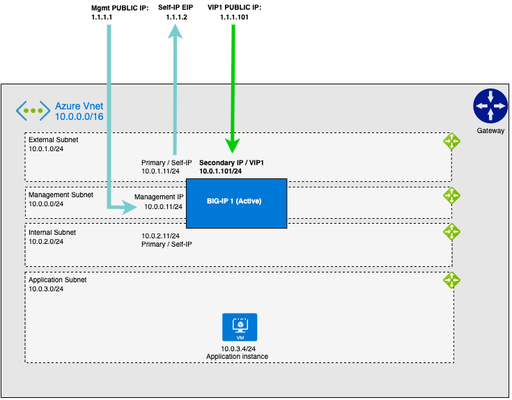

# Deploying the BIG-IP VE in Azure - Example Quickstart BIG-IP WAF (LTM + ASM) - Virtual Machine

[](https://github.com/f5networks/f5-azure-arm-templates-v2/releases)
[](https://github.com/f5networks/f5-azure-arm-templates-v2/issues)

## Contents

- [Deploying the BIG-IP VE in Azure - Example Quickstart BIG-IP WAF (LTM + ASM) - Virtual Machine](#deploying-the-big-ip-ve-in-azure---example-quickstart-big-ip-waf-ltm--asm---virtual-machine)
  - [Contents](#contents)
  - [Introduction](#introduction)
  - [Diagram](#diagram)
  - [Prerequisites](#prerequisites)
  - [Important Configuration Notes](#important-configuration-notes)
    - [Template Input Parameters](#template-input-parameters)
    - [Template Outputs](#template-outputs)
    - [Existing Network Template Input Parameters](#existing-network-template-input-parameters)
    - [Existing Network Template Outputs](#existing-network-template-outputs)
  - [Deploying this Solution](#deploying-this-solution)
    - [Deploying via the Azure Deploy button](#deploying-via-the-azure-deploy-button)
    - [Deploying via the Azure CLI](#deploying-via-the-azure-cli)
      - [Azure CLI (2.0) Script Example](#azure-cli-20-script-example)
    - [Changing the BIG-IP Deployment](#changing-the-big-ip-deployment)
  - [Validation](#validation)
    - [Validating the Deployment](#validating-the-deployment)
    - [Accessing the BIG-IP](#accessing-the-big-ip)
      - [SSH](#ssh)
      - [WebUI](#webui)
    - [Further Exploring](#further-exploring)
      - [WebUI](#webui-1)
      - [SSH](#ssh-1)
    - [Testing the WAF Service](#testing-the-waf-service)
  - [Deleting this Solution](#deleting-this-solution)
    - [Deleting the deployment via Azure Portal](#deleting-the-deployment-via-azure-portal)
    - [Deleting the deployment using the Azure CLI](#deleting-the-deployment-using-the-azure-cli)
  - [Troubleshooting Steps](#troubleshooting-steps)
  - [Security](#security)
  - [BIG-IP Versions](#big-ip-versions)
  - [Supported Instance Types and Hypervisors](#supported-instance-types-and-hypervisors)
  - [Documentation](#documentation)
  - [Getting Help](#getting-help)
    - [Filing Issues](#filing-issues)


## Introduction

The goal of this solution is to reduce prerequisites and complexity to a minimum so with a few clicks, a user can quickly deploy a BIG-IP, login and begin exploring the BIG-IP platform in a working full-stack deployment capable of passing traffic. 

This solution uses a parent template to launch several linked child templates (modules) to create an example BIG-IP solution. The linked templates are in the [examples/modules](https://github.com/F5Networks/f5-azure-arm-templates-v2/tree/main/examples/modules) directory in this repository. *F5 recommends you clone this repository and modify these templates to fit your use case.*

***Full Stack (azuredeploy.json)***<br>
Use the *azuredeploy.json* parent template to deploy an example full stack BIG-IP solution, complete with virtual network, bastion *(optional)*, dag/ingress, BIG-IP and example web application.  

***Existing Network Stack (azuredeploy-existing-network.json)***<br>
Use *azuredeploy-existing-network.json* parent template to deploy an example BIG-IP solution into an existing infrastructure. This template expects the virtual network, subnets, and bastion host(s) have already been deployed. The example web application is also not part of this parent template as it intended use is for an existing environment.

The modules below create the following resources:

- **Network**: This template creates Azure Virtual Networks, Subnets, and Route Tables. *(Full stack only)*
- **Bastion**: This template creates a bastion host for accessing the BIG-IP instances when no public IP address is used for the management interfaces. *(Full stack only)*
- **Application**: This template creates a generic example application for use when demonstrating live traffic through the BIG-IP instance. *(Full stack only)*
- **Disaggregation** *(DAG/Ingress)*: This template creates resources required to get traffic to the BIG-IP, including Network Security Groups, Public IP Addresses, NAT rules and probes.
- **Access**: This template creates a User-Assigned Managed Identity, grants it access to the supplied BIG-IP password Key Vault secret, and assigns it to the BIG-IP instances. Alternately, you can supply a pre-existing User-Assigned Managed Identity to assign to the instances.
- **BIG-IP**: This template creates F5 BIG-IP Virtual Edition instances provisioned with Local Traffic Manager (LTM) and (optionally) Application Security Manager (ASM). 


By default, this solution creates a VNet with four subnets, an example Web Application instance and a PAYG BIG-IP instance with three network interfaces (one for management and two for dataplane/application traffic - called external and internal). Application traffic from the Internet traverses an external network interface configured with both public and private IP addresses. Traffic to the application traverses an internal network interface configured with a private IP address.

***DISCLAIMER/WARNING***: To reduce prerequisites and complexity to a bare minimum for evaluation purposes only, this quickstart provides immediate access to the management interface via a Public IP. At the very *minimum*, configure the **restrictedSrcAddressMgmt** parameter to limit access to your client IP or trusted network. In production deployments, management access should never be directly exposed to the Internet and instead should be accessed via typical management best practices like jumpboxes/bastion hosts, VPNs, etc.


## Diagram



## Prerequisites

  - This solution requires an Azure [account](https://docs.microsoft.com/en-us/azure/azure-resource-manager/templates/overview#template-deployment-process) that can provision objects described in the solution and [resource group](https://docs.microsoft.com/en-us/azure/azure-resource-manager/management/manage-resource-groups-portal#create-resource-groups).
    - Azure Portal: [Create a Resource Group](https://docs.microsoft.com/en-us/azure/azure-resource-manager/management/manage-resource-groups-portal#create-resource-groups)
    - Azure CLI: 
      ```bash
      az group create -n ${RESOURCE_GROUP} -l ${REGION}
      ```
  - This solution requires an [SSH key](https://docs.microsoft.com/en-us/azure/virtual-machines/ssh-keys-portal) for access to the BIG-IP instances. For more information about creating a key pair for use in Azure, see Azure SSH key [documentation](https://docs.microsoft.com/en-us/azure/virtual-machines/linux/mac-create-ssh-keys).
  - This solution requires you to accept any Azure Marketplace "License/Terms and Conditions" for the images used in this solution.
    - By default, this solution uses [F5 BIG-IP BEST with IPI and Threat Campaigns (PAYG, 25Mbps)](https://azuremarketplace.microsoft.com/en-us/marketplace/apps/f5-networks.f5-big-ip-best)
    - Azure CLI: 
        ```bash
        az vm image terms accept --publisher f5-networks --offer f5-big-ip-best --plan f5-big-best-plus-hourly-25mbps
        ```
    - For more marketplace terms information, see Azure [documentation](https://docs.microsoft.com/en-us/azure/virtual-machines/linux/cli-ps-findimage#deploy-an-image-with-marketplace-terms).


## Important Configuration Notes

- By default, this solution creates a username **admin** with a **temporary** password set to value of the Azure virtual machine ID which is provided in the output **bigIpVmId** of the parent template. **IMPORTANT**: You should change this temporary password immediately following deployment.

- By default, in order to reduce requirements to a minimum, this solution does not create or require IAM resources (which are required to leverage cloud secrets to set passwords for example). However, if desired and permissions allow, the solution can conditionally provision IAM resources by providing various parameters combinations. 
  
  - By specifying a value for the **bigIpUserAssignManagedIdentity** input parameter, you can assign a pre-existing user-assigned identity to the BIG-IP instance. NOTE: ensure the pre-existing identity has all the permissions required for your solution. See Azure [documentation](https://docs.microsoft.com/en-us/azure/active-directory/managed-identities-azure-resources/how-manage-user-assigned-managed-identities?pivots=identity-mi-methods-azp#create-a-user-assigned-managed-identity) and the Access module [documentation](https://github.com/F5Networks/f5-azure-arm-templates-v2/blob/main/examples/modules/access/README.md) for more information on creating these resources.
  - By leaving the **bigIpUserAssignManagedIdentity** input parameter empty and specifying a value for either the **bigIpPasswordSecretId** *OR* the **bigIpPasswordSecretValue** input parameter, this solution will create a user-assigned identity which grants access to the Azure Key Vault secret. If a **bigIpPasswordSecretValue** value is provided, the solution creates an Azure Key Vault named `${uniqueString}kv` *(where `${uniqueString}` is the value provided for the **uniqueString** input parameter)* and a secret named `BigIpSecret`. See F5's KB article [K2873]() for more information on choosing a password.


  - The following scenarios are supported:
      - When neither **bigIpPasswordSecretId**, **bigIpPasswordSecretValue**, nor **bigIpUserAssignManagedIdentity** are provided: No IAM resources are created and no identity is assigned to the BIG-IP instance. This is the default.
      - When **bigIpUserAssignManagedIdentity** is provided: The existing identity is assigned to the BIG-IP instance. If the deployment uses an existing secret, you must grant the identity access to the secret before creating the deployment *AND* also provide the secret ID via the **bigIpPasswordSecretId** parameter.
      - When *only* **bigIpPasswordSecretId** is provided: A new user-assigned managed identity and Key Vault access policy will be created.
      - When *only* **bigIpPasswordSecretValue** is provided: A new secret, Key Vault, Key Vault Access Policy and user-assigned managed identity will all be created.

  - ***IMPORTANT:*** Although the templates support advanced IAM functionality, by default, the example BIG-IP Runtime-Init configurations for quickstart are basic and don't leverage secrets. If a secret and instance profile are provisioned like per above, you will also need to customize and re-host the example BIG-IP configuration files to use the secret. See [Changing the BIG-IP Deployment](#changing-the-big-ip-deployment) for more BIG-IP customization details.

  - **KeyVault Firewall:**
    - When providing an existing KeyVault secret, if Azure KeyVault Firewall is enabled and the default firewall action is Deny, you must explicitly add either the Azure public management IP address of the BIG-IP instance, or the Azure virtual network and management subnet, to the KeyVault Firewall allow list. *For more information, see [Azure KeyVault network security documentation](https://learn.microsoft.com/en-us/azure/key-vault/general/network-security).*

- When specifying values for the **bigIpInstanceType** parameter, ensure that the instance type you select is appropriate for the deployment scenario. Each instance types allow a fixed number of NICs and Secondary IP addresses. See [Azure Virtual Machine Instance Types](https://docs.microsoft.com/en-us/azure/virtual-machines/sizes) for more information.

- This solution requires Internet access for: 
  1. Downloading additional F5 software components used for onboarding and configuring the BIG-IP (via github.com). Internet access is required via the management interface and then via a dataplane interface (for example, external Self-IP) once a default route is configured. See [Overview of Mgmt Routing](https://support.f5.com/csp/article/K13284) for more details. By default, as a convenience, this solution provisions Public IPs to enable this but in a production environment, outbound access should be provided by a `routed` SNAT service (for example: NAT Gateway, custom firewall, etc.). *NOTE: access via web proxy is not currently supported. Other options include 1) hosting the file locally and modifying the runtime-init package URL and configuration files to point to local URLs instead or 2) baking them into a custom image, using the [F5 Image Generation Tool](https://clouddocs.f5.com/cloud/public/v1/ve-image-gen_index.html).*
  2. Contacting native cloud services for various cloud integrations: 
    - *Onboarding*:
        - [F5 BIG-IP Runtime Init](https://github.com/f5networks/f5-bigip-runtime-init) - to fetch secrets from native vault services
    - *Operation*:
        - [F5 Application Services 3](https://clouddocs.f5.com/products/extensions/f5-appsvcs-extension/latest/) - for features like Service Discovery
        - [F5 Telemetry Streaming](https://clouddocs.f5.com/products/extensions/f5-telemetry-streaming/latest/) - for logging and reporting
        - [Cloud Failover Extension (CFE)](https://clouddocs.f5.com/products/extensions/f5-cloud-failover/latest/) - for updating ip and routes mappings
    - Additional cloud services like [Private endpoints](https://docs.microsoft.com/en-us/azure/storage/common/storage-private-endpoints#connecting-to-private-endpoints) can be used to address calls to native services traversing the Internet.
  - See [Security](#security) section for more details. 

- This solution template provides an **initial** deployment only for an "infrastructure" use case ( meaning that it does not support managing the entire deployment exclusively via the template's "Redeploy" function). This solution leverages wa-agent to send the instance **customData**, which is only used to provide an initial BIG-IP configuration and not as the primary configuration API for a long-running platform. Although "Redeploy" can be used to update some cloud resources, as the BIG-IP configuration needs to align with the cloud resources, like IPs to NICs, updating one without the other can result in inconsistent states, while updating other resources, like the **image** or **instanceType**, can trigger an entire instance re-deloyment. For instance, to upgrade software versions, traditional in-place upgrades should be leveraged. See [AskF5 Knowledge Base](https://support.f5.com/csp/article/K84554955) and [Changing the BIG-IP Deployment](#changing-the-big-ip-deployment) for more information.

- If you have cloned this repository to modify the templates or BIG-IP config files and published to your own location, you can use the **templateBaseUrl** and **artifactLocation** input parameters to specify the new location of the customized templates and the **bigIpRuntimeInitConfig** input parameter to specify the new location of the BIG-IP Runtime-Init config. See main [/examples/README.md](../README.md#cloud-configuration) for more template customization details. See [Changing the BIG-IP Deployment](#changing-the-big-ip-deployment) for more BIG-IP customization details.

- In this solution, the BIG-IP VE has the [LTM](https://f5.com/products/big-ip/local-traffic-manager-ltm) and [ASM](https://f5.com/products/big-ip/application-security-manager-asm) modules enabled to provide advanced traffic management and web application security functionality. 

- If you are deploying the solution into an Azure region that supports Availability Zones, you can specify True for the useAvailabilityZones parameter. See [Azure Availability Zones](https://docs.microsoft.com/en-us/azure/availability-zones/az-region#azure-regions-with-availability-zones) for a list of regions that support Availability Zones.

- This template can send non-identifiable statistical information to F5 Networks to help us improve our templates. You can disable this functionality for this deployment only by supplying **false** for the value of the **allowUsageAnalytics** input parameter, or you can disable it system-wide by setting the **autoPhonehome** system class property value to false in the F5 Declarative Onboarding declaration. See [Sending statistical information to F5](#sending-statistical-information-to-f5).

- See [trouble shooting steps](#troubleshooting-steps) for more details.

### Template Input Parameters

**Required** means user input is required because there is no default value or an empty string is not allowed. If no value is provided, the template will fail to launch. In some cases, the default value may only work on the first deployment due to creating a resource in a global namespace and customization is recommended. See the Description for more details.

| Parameter | Required | Default | Type | Description |
| --- | --- | --- | --- | --- |
| allowUsageAnalytics | No | true | boolean | This deployment can send anonymous statistics to F5 to help us determine how to improve our solutions. If you select **false** statistics are not sent. |
| appContainerName | No | "f5devcentral/f5-demo-app:latest" | string | The name of a container to download and install which is used for the example application server(s). If this value is left blank, the application module template is not deployed. |
| artifactLocation | No | "f5-azure-arm-templates-v2/v2.0.0.0/examples/" | string | The directory, relative to the templateBaseUrl, where the modules folder is located. |
| bigIpHostname | No | bigip01.local | string | Supply the hostname you would like to use for the BIG-IP instance. The hostname must be in fqdn format and contain fewer than 63 characters. |
| bigIpImage | No | "f5-networks:f5-big-ip-best:f5-big-best-plus-hourly-25mbps:16.1.303000" | string | Two formats accepted. `URN` of the image to use in Azure marketplace or `ID` of custom image. Example URN value: "f5-networks:f5-big-ip-best:f5-big-best-plus-hourly-25mbps:16.1.303000". You can find the URNs of F5 marketplace images in the README for this template or by running the command: `az vm image list --output yaml --publisher f5-networks --all`. See https://clouddocs.f5.com/cloud/public/v1/azure/Azure_download.html for information on creating custom BIG-IP image. |
| bigIpInstanceType | No | "Standard_D8s_v4" | string | Enter a valid instance type. |
| bigIpLicenseKey | No |  | string | Supply the F5 BYOL license key for the BIG-IP instance. Leave this parameter blank if deploying the PAYG solution. |
| bigIpPasswordSecretId | No | | string | The full URL of an existing secretId to pass to the BIG-IP instance, including KeyVault Name. For example: https://yourvaultname.vault.azure.net/secrets/yoursecretid. If not provided, the solution will create a secret with the value provided for the bigIpPasswordSecretValue parameter. This parameter is ignored if bigIpUserAssignManagedIdentity is provided. |
| bigIpPasswordSecretValue | No | | string | The value to use for the secret to pass to the BIG-IP instance. If not provided, the solution will pass the value provided for the bigIpPasswordSecretId parameter. This parameter is ignored if bigIpUserAssignManagedIdentity is provided. |
| bigIpRuntimeInitConfig | No |  https://raw.githubusercontent.com/F5Networks/f5-azure-arm-templates-v2/v2.0.0.0/examples/quickstart/bigip-configurations/runtime-init-conf-3nic-payg-with-app.yaml | string | Supply a URL to the bigip-runtime-init configuration file in YAML or JSON format, or an escaped JSON string to use for f5-bigip-runtime-init configuration. |
| bigIpRuntimeInitPackageUrl | No | https://cdn.f5.com/product/cloudsolutions/f5-bigip-runtime-init/v1.4.1/dist/f5-bigip-runtime-init-1.4.1-1.gz.run | string | Supply a URL to the bigip-runtime-init package. |
| bigIpUserAssignManagedIdentity | No |  | string | Enter user-assigned pre-existing management identity ID to be associated to Virtual Machine. For example: "/subscriptions/f18b486b-112d-4402-add2-1112222333444/resourcegroups/yourresourcegroup/providers/Microsoft.ManagedIdentity/userAssignedIdentities/youridentity". |
| numNics | No | 3 | integer | Enter valid number of network interfaces (1-3) to create on the BIG-IP VE instance. |
| provisionPublicIpMgmt | No | true | boolean | Select true if you would like to provision a public IP address for accessing the BIG-IP instance(s).
| restrictedSrcAddressMgmt | **Yes** |  | string | An IP address or address range (in CIDR notation) used to restrict SSH and management GUI access to the BIG-IP Management or bastion host instances. **Important**: The VPC CIDR is automatically added for internal use (access via bastion host, clustering, etc.). Please do NOT use "0.0.0.0/0". Instead, restrict the IP address range to your client or trusted network, for example "55.55.55.55/32". Production should never expose the BIG-IP Management interface to the Internet.|
| restrictedSrcAddressApp | **Yes** |  | string | An IP address range (CIDR) that can be used to restrict access web traffic (80/443) to the BIG-IP instances, for example "X.X.X.X/32" for a host, "0.0.0.0/0" for the Internet, etc. **NOTE**: The VPC CIDR is automatically added for internal use. |
| sshKey | **Yes** |  | string | Supply the public key that will be used for SSH authentication to the BIG-IP and application virtual machines. Note: This should be the public key as a string, typically starting with **ssh-rsa**. |
| tagValues | No | {"application": "f5demoapp", "cost": "f5cost", "environment": "f5env", "group": "f5group", "owner": "f5owner"} | object | Default key/value resource tags will be added to the resources in this deployment, if you would like the values to be unique adjust them as needed for each key. |
| templateBaseUrl | No | https://cdn.f5.com/product/cloudsolutions/ | string | The publicly accessible URL where the linked ARM templates are located. |
| uniqueString | **Yes** |  | string | A prefix that will be used to name template resources. Because some resources require globally unique names, we recommend using a unique value. |
| useAvailabilityZones | No | false | boolean | This deployment can deploy resources into Azure Availability Zones (if the region supports it). If that is not desired the input should be set false. If the region does not support availability zones the input should be set to false. |

### Template Outputs

| Name | Required Resource | Type | Description |
| --- | --- | --- | --- |
| appPrivateIp | Application Template | string | Application Private IP Address. |
| appUsername | Application Template | string | Application user name. |
| appVmName | Application Template | string | Application Virtual Machine name. |
| bigIpManagementPrivateIp | BIG-IP Template | string | Management Private IP Address. |
| bigIpManagementPrivateUrl | BIG-IP Template | string | Management Private IP Address. |
| bigIpManagementPublicIpId | Dag Template | string | Management Public IP Address. |
| bigIpManagementPublicUrl | Dag Template | string | Management Public IP Address. |
| bigIpSecretId | Access Template | string | Key Vault/Secret resource ID |
| bigIpUsername | BIG-IP Template | string | BIG-IP user name. |
| bigIpVmId | BIG-IP Template | string | Virtual Machine resource ID. |
| vip1PrivateIp | Application Template | string | Service (VIP) Private IP Address. |
| vip1PrivateUrlHttp | Application Template | string | Service (VIP) Private HTTP URL. |
| vip1PrivateUrlHttps | Application Template | string | Service (VIP) Private HTTPS URL. |
| vip1PublicIp | Dag Template | string | Service (VIP) Public IP Address. |
| vip1PublicIpDns | Dag Template | string | Service (VIP) Public DNS. |
| vip1PublicUrlHttp | Dag Template | string | Service (VIP) Public HTTP URL. |
| vip1PublicUrlHttps | Dag Template | string | Service (VIP) Public HTTPS URL. |
| virtualNetworkId | Network Template | string | Virtual Network resource ID. |
| wafPublicIps | Dag Template | array | External Public IP Addresses. |


### Existing Network Template Input Parameters

| Parameter | Required | Default | Type | Description |
| --- | --- | --- | --- | --- |
| allowUsageAnalytics | No | true | boolean | This deployment can send anonymous statistics to F5 to help us determine how to improve our solutions. If you select **false** statistics are not sent. |
| artifactLocation | No | "f5-azure-arm-templates-v2/v2.0.0.0/examples/" | string | The directory, relative to the templateBaseUrl, where the modules folder is located. |
| bigIpHostname | No | bigip01.local | string | Supply the hostname you would like to use for the BIG-IP instance. The hostname must be in fqdn format and contain fewer than 63 characters. |
| bigIpImage | No | "f5-networks:f5-big-ip-best:f5-big-best-plus-hourly-25mbps:16.1.303000" | string | Two formats accepted. `URN` of the image to use in Azure marketplace or `ID` of custom image. Example URN value: "f5-networks:f5-big-ip-best:f5-big-best-plus-hourly-25mbps:16.1.303000". You can find the URNs of F5 marketplace images in the README for this template or by running the command: `az vm image list --output yaml --publisher f5-networks --all`. See https://clouddocs.f5.com/cloud/public/v1/azure/Azure_download.html for information on creating custom BIG-IP image. |
| bigIpInstanceType | No | "Standard_D8s_v4" | string | Enter a valid instance type. |
| bigIpLicenseKey | No |  | string | Supply the F5 BYOL license key for the BIG-IP instance. Leave this parameter blank if deploying the PAYG solution. |
| bigIpPasswordSecretId | No | | string | The full URL of an existing secretId to pass to the BIG-IP instance, including KeyVault Name. For example: https://yourvaultname.vault.azure.net/secrets/yoursecretid. If not provided, the solution will create a secret with the value provided for the bigIpPasswordSecretValue parameter. This parameter is ignored if bigIpUserAssignManagedIdentity is provided. |
| bigIpPasswordSecretValue | No | | string | The value to use for the secret to pass to the BIG-IP instance. If not provided, the solution will pass the value provided for the bigIpPasswordSecretId parameter. This parameter is ignored if bigIpUserAssignManagedIdentity is provided. |
| bigIpRuntimeInitConfig | No | https://raw.githubusercontent.com/F5Networks/f5-azure-arm-templates-v2/v2.0.0.0/examples/quickstart/bigip-configurations/runtime-init-conf-3nic-payg.yaml | string | Supply a URL to the bigip-runtime-init configuration file in YAML or JSON format, or an escaped JSON string to use for f5-bigip-runtime-init configuration. |
| bigIpRuntimeInitPackageUrl | No | https://cdn.f5.com/product/cloudsolutions/f5-bigip-runtime-init/v1.4.1/dist/f5-bigip-runtime-init-1.4.1-1.gz.run | string | Supply a URL to the bigip-runtime-init package. |
| numNics | No | 3 | integer | Enter valid number of network interfaces (1-3) to create on the BIG-IP VE instance. |
| bigIpMgmtSubnetId | **Yes** |  | string | Supply the Azure resource ID of the internal subnet where BIG-IP VE instances will be deployed. Required for 1 NIC deployments. |
| bigIpExternalSubnetId | **Yes** |  | string | Supply the Azure resource ID of the management subnet where BIG-IP VE instances will be deployed. Required for 2 NIC deployments. |
| bigIpInternalSubnetId | **Yes** |  | string | Supply the Azure resource ID of the external subnet where BIG-IP VE instances will be deployed. Required for 3 NIC deployments. |
| bigIpMgmtSelfAddress | No | 10.0.0.11 | string | Management Private IP Address for the BIG-IP Instance. IP address parameter must be in the form x.x.x.x. |
| bigIpExternalSelfAddress | No | 10.0.1.11 | string | External Private IP Address for the BIG-IP Instance. IP address parameter must be in the form x.x.x.x. |
| bigIpInternalSelfAddress | No | 10.0.2.11 | string | Internal Private IP Address for the BIG-IP Instance. IP address parameter must be in the form x.x.x.x. |
| bigIpUserAssignManagedIdentity | No |  | string | Enter user-assigned pre-existing management identity ID to be associated to Virtual Machine. For example: "/subscriptions/f18b486b-112d-4402-add2-1112222333444/resourcegroups/yourresourcegroup/providers/Microsoft.ManagedIdentity/userAssignedIdentities/youridentity". |
| provisionPublicIpMgmt | No | false | boolean | Select true if you would like to provision a public IP address for accessing the BIG-IP instance. |
| provisionServicePublicIp | No | false | boolean | Flag to deploy public IP address resource for application. |
| restrictedSrcAddressMgmt | **Yes** |  | string | An IP address or address range (in CIDR notation) used to restrict SSH and management GUI access to the BIG-IP Management or bastion host instances. **Important**: The VPC CIDR is automatically added for internal use (access via bastion host, clustering, etc.). Please do NOT use "0.0.0.0/0". Instead, restrict the IP address range to your client or trusted network, for example "55.55.55.55/32". Production should never expose the BIG-IP Management interface to the Internet. |
| restrictedSrcAddressApp | **Yes** |  | string | An IP address range (CIDR) that can be used to restrict access web traffic (80/443) to the BIG-IP instances, for example "X.X.X.X/32" for a host, "0.0.0.0/0" for the Internet, etc. **NOTE**: The VPC CIDR is automatically added for internal use. |
| servicePrivateIpAddress | No |  | string | External private VIP Address for BIGIP Instance. IP address parameter must be in the form x.x.x.x. The address must reside in the same subnet and address space as the IP address provided for bigIpExternalSelfAddress. |
| sshKey | **Yes** |  | string | Supply the public key that will be used for SSH authentication to the BIG-IP and application virtual machines. Note: This should be the public key as a string, typically starting with **ssh-rsa**. |
| tagValues | No | {"application": "f5demoapp", "cost": "f5cost", "environment": "f5env", "group": "f5group", "owner": "f5owner"} | object | Default key/value resource tags will be added to the resources in this deployment, if you would like the values to be unique adjust them as needed for each key. |
| templateBaseUrl | No | https://cdn.f5.com/product/cloudsolutions/ | string | The publicly accessible URL where the linked ARM templates are located. |
| uniqueString | **Yes** |  | string | A prefix that will be used to name template resources. Because some resources require globally unique names, we recommend using a unique value. |
| useAvailabilityZones | No | false | boolean | This deployment can deploy resources into Azure Availability Zones (if the region supports it). If that is not desired the input should be set false. If the region does not support availability zones the input should be set to false. |


### Existing Network Template Outputs

| Name | Required Resource | Type | Description |
| --- | --- | --- | --- |
| bigIpManagementPrivateIp | BIG-IP Template | string | Management Private IP Address. |
| bigIpManagementPrivateUrl | BIG-IP Template | string | Management Private IP Address. |
| bigIpManagementPublicIp | Dag Template | string | Management Public IP Address. |
| bigIpManagementPublicUrl | Dag Template | string | Management Public IP Address. |
| bigIpSecretId | Access Template | string | Key Vault/Secret resource ID |
| bigIpUsername | BIG-IP Template | string | BIG-IP user name. |
| bigIpVmId | BIG-IP Template | string | Virtual Machine resource ID. |
| vip1PrivateIp | Service Private IP Address | string | Service (VIP) Private IP Address. |
| vip1PrivateUrlHttp | Service Private IP Address | string | Service (VIP) Private HTTP URL. |
| vip1PrivateUrlHttps | Service Private IP Address | string | Service (VIP) Private HTTPS URL. |
| vip1PublicIp | Dag Template | string | Service (VIP) Public IP Address. |
| vip1PublicIpDns | Dag Template | string | Service (VIP) Public DNS. |
| vip1PublicUrlHttp | Dag Template | string | Service (VIP) Public HTTP URL. |
| vip1PublicUrlHttps | Dag Template | string | Service (VIP) Public HTTPS URL. |
| wafPublicIps | Dag Template | array | External Public IP Addresses. |


## Deploying this Solution

Two options for deploying this solution include:

- Using the [Azure deploy button](#deploying-via-the-azure-deploy-button) - in the Azure Portal
- Using [CLI Tools](#deploying-via-the-azure-cli)

### Deploying via the Azure Deploy button

The easiest way to deploy this Azure Arm templates is to use the deploy button below:<br>

**Full Stack**
[](https://portal.azure.com/#create/Microsoft.Template/uri/https%3A%2F%2Fraw.githubusercontent.com%2FF5Networks%2Ff5-azure-arm-templates-v2%2Fv2.7.0.0%2Fexamples%2Fquickstart%2Fazuredeploy.json)

**Existing Stack**
[](https://portal.azure.com/#create/Microsoft.Template/uri/https%3A%2F%2Fraw.githubusercontent.com%2FF5Networks%2Ff5-azure-arm-templates-v2%2Fv2.7.0.0%2Fexamples%2Fquickstart%2Fazuredeploy-existing-network.json)

*Step 1: Custom Template Page* 
  - Select or Create New Resource Group.
  - Fill in the *REQUIRED* parameters. 
    - **sshKey**
    - **restrictedSrcAddressApp**
    - **restrictedSrcAddressMgmt**
    - **uniqueString**
  - And any network related parameters if deploying the azuredeploy-existing-network.json template, for example:
    - **bigIpMgmtSubnetId** *(for 1 NIC)*
    - **bigIpExternalSubnetId** *(for 2 NIC)*
    - **bigIpInternalSubnetId** *(for 3 NIC)*
  - As well as the static IP address related parameters, which have defaults, but need to be mapped to your network.
  - Click "Next: Review + Create".

*Step 2: Custom Template Page*
  After "Validation Passed" click "Create".

For next steps, see [Validating the Deployment](#validating-the-deployment).

### Deploying via the Azure CLI

As an alternative to deploying through the Azure Portal (GUI), each solution provides an example Azure CLI 2.0 command to deploy the ARM template. The following example deploys a 3-NIC BIG-IP VE.

#### Azure CLI (2.0) Script Example

*NOTE: First replace parameter values with `<YOUR_VALUE>` with your values.*

```bash
RESOURCE_GROUP="myGroupName"
REGION="eastus"
DEPLOYMENT_NAME="parentTemplate"
TEMPLATE_URI="https://raw.githubusercontent.com/f5networks/f5-azure-arm-templates-v2/v2.8.0.0/examples/quickstart/azuredeploy.json"
DEPLOY_PARAMS='{"templateBaseUrl":{"value":"https://raw.githubusercontent.com/f5networks/f5-azure-arm-templates-v2/"},"artifactLocation":{"value":"v2.8.0.0/examples/"},"uniqueString":{"value":"<YOUR_VALUE>"},"sshKey":{"value":"<YOUR_VALUE>"},"bigIpInstanceType":{"value":"Standard_D8s_v4"},"bigIpImage":{"value":"f5-networks:f5-big-ip-best:f5-big-best-plus-hourly-25mbps:16.1.303000"},"appContainerName":{"value":"f5devcentral/f5-demo-app:latest"},"restrictedSrcAddressMgmt":{"value":"<YOUR_VALUE>"},"restrictedSrcAddressApp":{"value":"<YOUR_VALUE>"}, "bigIpRuntimeInitConfig":{"value":"https://raw.githubusercontent.com/f5networks/f5-azure-arm-templates-v2/v2.8.0.0/examples/quickstart/bigip-configurations/runtime-init-conf-3nic-payg.yaml"},"useAvailabilityZones":{"value":false},"numNics":{"value":3}}'
DEPLOY_PARAMS_FILE=deploy_params.json
echo ${DEPLOY_PARAMS} > ${DEPLOY_PARAMS_FILE}
az group create -n ${RESOURCE_GROUP} -l ${REGION}
az deployment group create --resource-group ${RESOURCE_GROUP} --name ${DEPLOYMENT_NAME} --template-uri ${TEMPLATE_URI}  --parameters @${DEPLOY_PARAMS_FILE}
```

When deploying **azuredeploy-existing-network.json**, modify the deployment parameters to match the requirements specified in the **Existing Network Template Input Parameters** table above.

For next steps, see [Validating the Deployment](#validating-the-deployment).


### Changing the BIG-IP Deployment

You will most likely want or need to change the BIG-IP configuration. This generally involves referencing or customizing a [F5 BIG-IP Runtime Init](https://github.com/f5networks/f5-bigip-runtime-init) configuration file and passing it through the **bigIpRuntimeInitConfig** template parameter as a URL or inline json. 

Example from azuredeploy.parameters.json
```json
    "useAvailabilityZones": {
        "value": false
    },
    "bigIpRuntimeInitConfig": {
        "value": "https://raw.githubusercontent.com/f5networks/f5-azure-arm-templates-v2/v2.8.0.0/examples/quickstart/bigip-configurations/runtime-init-conf-3nic-payg.yaml"
    },
```

**IMPORTANT**: Note the "raw.githubusercontent.com". Any URLs pointing to github **must** use the raw file format. 

The F5 BIG-IP Runtime Init configuration file can also be formatted in json and/or passed directly inline:

```json
    "useAvailabilityZones": {
        "value": false
    },
    "bigIpRuntimeInitConfig": {
        "value": "{\"controls\":{\"logLevel\":\"info\",\"logFilename\":\"/var/log/cloud/bigIpRuntimeInit.log\"},\"extension_packages\":{\"install_operations\":[{\"extensionType\":\"do\",\"extensionVersion\":\"1.27.0\",\"extensionHash\":\"2aee4a29ac64b38ac5af7d41607a966cac063c99a339b228225ffa38f8f9a4cf\"},{\"extensionType\":\"as3\",\"extensionVersion\":\"3.34.0\",\"extensionHash\":\"05a80ec0848dc5b8876b78a8fbee2980d5a1671d635655b3af604dc830d5fed4\"},{\"extensionType\":\"cf\",\"extensionVersion\":\"1.10.0\",\"extensionHash\":\"d758c985cac4dbef4b0732fe5900317ae97e67c6efca621a5b2b02c8c4bbeace\"}]},\"extension_services\":{\"service_operations\":[{\"extensionType\":\"do\",\"type\":\"inline\",\"value\":{\"schemaVersion\":\"1.0.0\",\"class\":\"Device\",\"async\":true,\"label\":\"Standalone 3NIC BIG-IP declaration for Declarative Onboarding with BYOL license\",\"Common\":{\"class\":\"Tenant\",\"My_DbVariables\":{\"class\":\"DbVariables\",\"provision.extramb\":1000,\"restjavad.useextramb\":true,\"dhclient.mgmt\":\"disable\",\"config.allow.rfc3927\":\"enable\",\"tm.tcpudptxchecksum\":\"Software-only\"},\"My_Provisioning\":{\"class\":\"Provision\",\"asm\":\"nominal\",\"ltm\":\"nominal\"},\"My_Ntp\":{\"class\":\"NTP\",\"servers\":[\"0.pool.ntp.org\",\"1.pool.ntp.org\"],\"timezone\":\"UTC\"},\"My_Dns\":{\"class\":\"DNS\",\"nameServers\":[\"168.63.129.16\"]},\"My_System\":{\"autoPhonehome\":true,\"class\":\"System\",\"hostname\":\"failover01.local\"},\"My_License\":{\"class\":\"License\",\"licenseType\":\"regKey\",\"regKey\":\"REPLACE_WITH_VALID_REGKEY\"},\"admin\":{\"class\":\"User\",\"userType\":\"regular\",\"password\":\"{{{BIGIP_PASSWORD}}}\",\"shell\":\"bash\"},\"default\":{\"class\":\"ManagementRoute\",\"gw\":\"10.0.0.1\",\"network\":\"default\"},\"dhclient_route1\":{\"class\":\"ManagementRoute\",\"gw\":\"10.0.0.1\",\"network\":\"168.63.129.16/32\"},\"azureMetadata\":{\"class\":\"ManagementRoute\",\"gw\":\"10.0.0.1\",\"network\":\"169.254.169.254/32\"},\"defaultRoute\":{\"class\":\"Route\",\"gw\":\"10.0.1.1\",\"network\":\"default\",\"mtu\":1500},\"external\":{\"class\":\"VLAN\",\"tag\":4094,\"mtu\":1500,\"interfaces\":[{\"name\":\"1.1\",\"tagged\":false}]},\"external-self\":{\"class\":\"SelfIp\",\"address\":\"{{{SELF_IP_EXTERNAL}}}\",\"vlan\":\"external\",\"allowService\":[\"tcp:443\",\"udp:1026\",\"tcp:4353\",\"tcp:6123\",\"tcp:6124\",\"tcp:6125\",\"tcp:6126\",\"tcp:6127\",\"tcp:6128\"],\"trafficGroup\":\"traffic-group-local-only\"},\"internal\":{\"class\":\"VLAN\",\"interfaces\":[{\"name\":\"1.2\",\"tagged\":false}],\"mtu\":1500,\"tag\":4093},\"internal-self\":{\"class\":\"SelfIp\",\"address\":\"{{{SELF_IP_INTERNAL}}}\",\"vlan\":\"internal\",\"allowService\":\"none\",\"trafficGroup\":\"traffic-group-local-only\"},\"configSync\":{\"class\":\"ConfigSync\",\"configsyncIp\":\"/Common/external-self/address\"},\"failoverAddress\":{\"class\":\"FailoverUnicast\",\"address\":\"/Common/external-self/address\"},\"failoverGroup\":{\"class\":\"DeviceGroup\",\"type\":\"sync-failover\",\"members\":[\"failover01local\",\"failover02.local\"],\"owner\":\"/Common/failoverGroup/members/0\",\"autoSync\":true,\"saveOnAutoSync\":false,\"networkFailover\":true,\"fullLoadOnSync\":false,\"asmSync\":false},\"trust\":{\"class\":\"DeviceTrust\",\"localUsername\":\"admin\",\"localPassword\":\"{{{BIGIP_PASSWORD}}}\",\"remoteHost\":\"/Common/failoverGroup/members/0\",\"remoteUsername\":\"admin\",\"remotePassword\":\"{{{BIGIP_PASSWORD}}}\"}}}},{\"extensionType\":\"cf\",\"type\":\"inline\",\"value\":{\"schemaVersion\":\"1.0.0\",\"class\":\"Cloud_Failover\",\"environment\":\"azure\",\"controls\":{\"class\":\"Controls\",\"logLevel\":\"silly\"},\"externalStorage\":{\"scopingTags\":{\"f5_cloud_failover_label\":\"bigip_high_availability_solution\"}},\"failoverAddresses\":{\"enabled\":true,\"scopingTags\":{\"f5_cloud_failover_label\":\"bigip_high_availability_solution\"},\"requireScopingTags\":false}}},{\"extensionType\":\"as3\",\"type\":\"inline\",\"value\":{\"class\":\"ADC\",\"schemaVersion\":\"3.0.0\",\"label\":\"Failover\",\"remark\":\"Failover\",\"Tenant_1\":{\"class\":\"Tenant\",\"Shared\":{\"class\":\"Application\",\"template\":\"shared\",\"Shared_Pool\":{\"class\":\"Pool\",\"remark\":\"Service 1 shared pool\",\"members\":[{\"serverAddresses\":[\"10.0.3.4\"],\"servicePort\":80}],\"monitors\":[\"http\"]},\"Custom_HTTP_Profile\":{\"class\":\"HTTP_Profile\",\"xForwardedFor\":true},\"Custom_WAF_Policy\":{\"class\":\"WAF_Policy\",\"url\":\"https://raw.githubusercontent.com/F5Networks/f5-azure-arm-templates-v2/v2.8.0.0/examples/failover/bigip-configurations/Rapid_Deployment_Policy_13_1.xml\",\"enforcementMode\":\"blocking\",\"ignoreChanges\":false},\"Service_Address_01\":{\"class\":\"Service_Address\",\"virtualAddress\":\"10.0.1.101\"}},\"HTTP_Service\":{\"class\":\"Application\",\"template\":\"http\",\"serviceMain\":{\"class\":\"Service_HTTP\",\"virtualAddresses\":[{\"use\":\"/Tenant_1/Shared/Service_Address_01\"}],\"snat\":\"auto\",\"pool\":\"/Tenant_1/Shared/Shared_Pool\",\"profileHTTP\":{\"use\":\"/Tenant_1/Shared/Custom_HTTP_Profile\"},\"policyWAF\":{\"use\":\"/Tenant_1/Shared/Custom_WAF_Policy\"}}},\"HTTPS_Service\":{\"class\":\"Application\",\"template\":\"https\",\"serviceMain\":{\"class\":\"Service_HTTPS\",\"virtualAddresses\":[{\"use\":\"/Tenant_1/Shared/Service_Address_01\"}],\"snat\":\"auto\",\"pool\":\"/Tenant_1/Shared/Shared_Pool\",\"profileHTTP\":{\"use\":\"/Tenant_1/Shared/Custom_HTTP_Profile\"},\"policyWAF\":{\"use\":\"/Tenant_1/Shared/Custom_WAF_Policy\"},\"serverTLS\":{\"bigip\":\"/Common/clientssl\"},\"redirect80\":false}}}}}]},\"post_onboard_enabled\":[],\"pre_onboard_enabled\":[{\"name\":\"provision_rest\",\"type\":\"inline\",\"commands\":[\"/usr/bin/setdb provision.extramb 1000\",\"/usr/bin/setdb restjavad.useextramb true\"]}],\"runtime_parameters\":[{\"name\":\"BIGIP_PASSWORD\",\"type\":\"secret\",\"secretProvider\":{\"type\":\"KeyVault\",\"environment\":\"azure\",\"vaultUrl\":\"https://yourvaultname.vault.azure.net\",\"secretId\":\"mySecretId\"}},{\"name\":\"SELF_IP_EXTERNAL\",\"type\":\"metadata\",\"metadataProvider\":{\"type\":\"network\",\"environment\":\"azure\",\"field\":\"ipv4\",\"index\":1}},{\"name\":\"SELF_IP_INTERNAL\",\"type\":\"metadata\",\"metadataProvider\":{\"type\":\"network\",\"environment\":\"azure\",\"field\":\"ipv4\",\"index\":2}}]}"
    },
```

NOTE: If providing the json inline as a template parameter, you must escape all double quotes so it can be passed as a single parameter string.

*TIP: If you haven't forked/published your own repository or don't have an easy way to host your own config files, passing the config as inline json via the template input parameter might be the quickest / most accessible option to test out different BIG-IP configs using this repository.*

F5 has provided the following example configuration files in the `examples/quickstart/bigip-configurations` folder:

- These examples install Automation Tool Chain packages for a PAYG licensed deployment.
  - `runtime-init-conf-1nic-payg.yaml`
  - `runtime-init-conf-2nic-payg.yaml`
  - `runtime-init-conf-3nic-payg.yaml`
- These examples install Automation Tool Chain packages and create WAF-protected services for a PAYG licensed deployment.
  - `runtime-init-conf-1nic-payg-with-app.yaml`
  - `runtime-init-conf-2nic-payg-with-app.yaml`
  - `runtime-init-conf-3nic-payg-with-app.yaml`
- These examples install Automation Tool Chain packages for a BYOL licensed deployment.
  - `runtime-init-conf-1nic-byol.yaml`
  - `runtime-init-conf-2nic-byol.yaml`
  - `runtime-init-conf-3nic-byol.yaml`
- These examples install Automation Tool Chain packages and create WAF-protected services for a BYOL licensed deployment.
  - `runtime-init-conf-1nic-byol-with-app.yaml`
  - `runtime-init-conf-2nic-byol-with-app.yaml`
  - `runtime-init-conf-3nic-byol-with-app.yaml`
- `Rapid_Deployment_Policy_13_1.xml` - This ASM security policy is supported for BIG-IP 13.1 and later.

See [F5 BIG-IP Runtime Init](https://github.com/f5networks/f5-bigip-runtime-init) for more examples.

**IMPORTANT**: 
By default, this solution deploys a 3-NIC PAYG BIG-IP:
  - The **Full Stack** (azuredeploy.json) references the `runtime-init-conf-3nic-payg-with-app.yaml` BIG-IP config file, which includes an example virtual service, and can be used as is. This example configuration does not require any modifications to deploy successfully *(Disclaimer: "Successfully" implies the template deploys without errors and deploys BIG-IP WAFs capable of passing traffic. To be fully functional as designed, you would need to have satisfied the [Prerequisites](#prerequisites))*. However, in production, these files would commonly be customized. Some examples of small customizations or modifications are provided below. 
  - The **Existing Network Stack** (azuredeploy-existing-network.json) references the `runtime-init-conf-3nic-payg.yaml` BIG-IP config file, which only provides basic system onboarding and does not **NOT** include an example virtual service, and can be used as is.

To deploy a **1NIC** instance:
  1. Update the **numNics** input parameter to **1**.
  2. Update the **bigIpRuntimeInitConfig** input parameter to reference a corresponding `1nic` config file (for example, runtime-init-conf-1nic-payg.yaml).


To deploy a **2NIC** instance:
  1. Update the **numNics** input parameter to **2**.
  2. Update the **bigIpRuntimeInitConfig** input parameter to reference a corresponding `2nic` config file (for example, runtime-init-conf-2nic-payg.yaml).


To deploy a **BYOL** instance:
  1. Update the **bigIpImage** input parameter to use a `byol` image.
      Example:
      ```json 
      "bigIpImage":{ 
        "value": "f5-networks:f5-big-ip-byol:f5-big-all-2slot-byol:16.0.101000" 
      }
      ```
  2. Update the **bigIpLicenseKey** input parameters to reference the registration key to use when licensing the BIG-IP instance.
      Example:
      ```json
      "bigIpLicenseKey":{ 
        "value": "AAAAA-BBBBB-CCCCC-DDDDD-EEEEEEE" 
      }
      ```
  3. Update the **bigIpRuntimeInitConfig** input parameter to reference the corresponding `byol` config file (for example, `runtime-init-conf-3nic-byol-with-app.yaml`).


However, most changes require customizing the example configuration files. 

To change BIG-IP configuration:

1. Edit/modify the declaration(s) in the example runtime-init config file with the new `<VALUES>`. For example, if you wanted to change the DNS or NTP settings, update values in the Declarative Onboarding declaration:

    Example:

    ```yaml
              My_Dns:
                class: DNS
                nameServers:
                  - <YOUR_CUSTOM_DNS_SERVER>
              My_License:
                class: License
                licenseType: regKey
                regKey: '{{{LICENSE_KEY}}}'
              My_Ntp:
                class: NTP
                servers:
                  - <YOUR_CUSTOM_NTP_SERVER>
                timezone: UTC
    ```

    or if you wanted to set the admin password using a secret instead, update the `BIGIP_PASSWORD` runtime parameter from using the Virtual Machine ID:

    Example:
    ```yaml
    runtime_parameters:
      - name: BIGIP_PASSWORD
        type: url
        query: vmId
        value: 'http://169.254.169.254/metadata/instance/compute?api-version=2017-08-01'
        headers:
          - name: Metadata
            value: true
    ```

    to using the secret.

    ```yaml
    runtime_parameters:
      - name: VAULT_URL
        type: url
        value: file:///config/cloud/vault_url
      - name: SECRET_ID
        type: url
        value: file:///config/cloud/secret_id
      - name: BIGIP_PASSWORD
        type: secret
        secretProvider:
          type: KeyVault
          environment: azure
          vaultUrl: '{{{VAULT_URL}}}'
          secretId: '{{{SECRET_ID}}}'
    ```


2. Publish/host the customized runtime-init config file at a location reachable by the BIG-IP at deploy time (for example, Azure Storage, git, etc.).
3. Update the **bigIpRuntimeInitConfig** input parameter to reference the new URL of the updated BIG-IP configuration.


In order deploy additional **virtual services**:

For illustration purposes, this solution pre-provisions IP addresses and the runtime-init configurations contain an AS3 declaration to create an example virtual service. However, in practice, cloud-init runs once and is typically used for initial provisioning, not as the primary configuration API for a long-running platform. More typically in an infrastructure use case, virtual services are not included in the initial cloud-init configuration are added post initial deployment which involves:
  1. *Cloud* - Provisioning additional IPs on the desired Network Interfaces. Examples:
      - [az network nic ip-config create](https://docs.microsoft.com/en-us/cli/azure/network/nic/ip-config?view=azure-cli-latest#az_network_nic_ip_config_create)
      - [az network public-ip create](https://docs.microsoft.com/en-us/cli/azure/network/public-ip?view=azure-cli-latest#az_network_public_ip_create)
      - [az network nic ip-config update](https://docs.microsoft.com/en-us/cli/azure/network/nic/ip-config?view=azure-cli-latest#az_network_nic_ip_config_update)
  2. *BIG-IP* - Creating Virtual Services that match those additional Secondary IPs 
      - Updating the [AS3](https://clouddocs.f5.com/products/extensions/f5-appsvcs-extension/latest/userguide/composing-a-declaration.html) declaration with additional Virtual Services (see **virtualAddresses:**).


*NOTE: For cloud resources, templates can be customized to pre-provision and update additional resources (for example: various combinations of NICs, Private IPs, Public IPs, etc.). Please see [Getting Help](#getting-help) for more information. For BIG-IP configurations, you can leverage any REST or Automation Tool Chain clients like [Ansible](https://ansible.github.io/workshops/exercises/ansible_f5/3.0-as3-intro/),[Terraform](https://registry.terraform.io/providers/F5Networks/bigip/latest/docs/resources/bigip_as3),etc.*


## Validation

This section describes how to validate the template deployment, test the WAF service, and troubleshoot common problems.

### Validating the Deployment

To view the status of the example and module template deployments, navigate to **Resource Groups > *RESOURCE_GROUP* > Deployments**. You should see a series of deployments, including the parent template as well as the linked templates, which can include: networkTemplate, appTemplate, dagTemplate and bigIpTemplate. The deployment status for each template deployment should be "Succeeded". 

Expected Deploy time for entire stack =~ 8-10 minutes.

If any of the deployments are in a failed state, proceed to the [Troubleshooting Steps](#troubleshooting-steps) section below.

### Accessing the BIG-IP

From Parent Template Outputs:
  - **Console**:  Navigate to **Resource Groups > *RESOURCE_GROUP* > Deployments > *DEPLOYMENT_NAME* > Outputs**.
  - **Azure CLI**: 
    ```bash
    az deployment group show --resource-group ${RESOURCE_GROUP} --name ${DEPLOYMENT_NAME}  -o tsv --query properties.outputs" 
    ```

- Obtain the vmId of the BIG-IP Virtual Machine *(will be used for password later)*:
  - **Console**: Navigate to **Resource Groups > *RESOURCE_GROUP* > Deployments > *DEPLOYMENT_NAME* > Outputs > bigIpVmId**.
  - **Azure CLI**: 
    ```bash
    az deployment group show --resource-group ${RESOURCE_GROUP} --name ${DEPLOYMENT_NAME}  -o tsv --query properties.outputs.bigIpVmId.value
    ```

- Obtain the public IP address of the BIG-IP Management Port:
  - **Console**: Navigate to **Resource Groups > *RESOURCE_GROUP* > Deployments > *DEPLOYMENT_NAME* > Outputs > *bigIpManagementPublicIp***.
  - **Azure CLI**: 
    ``` bash 
    az deployment group show --resource-group ${RESOURCE_GROUP} --name ${DEPLOYMENT_NAME} -o tsv --query properties.outputs.bigIpManagementPublicIp.value
    ```

- Or if you are going through a bastion host (when **provisionPublicIpMgmt** = **false**):
  - Obtain the public IP address of the bastion host:
    - **Console**: Navigate to **Resource Groups > *RESOURCE_GROUP* > Overview > *uniqueId*-bastion-vm > Public IP address**.


  - Obtain the private IP address of the BIG-IP Management Port:
    - **Console**: Navigate to **Resource Groups > *RESOURCE_GROUP* > Deployments > *DEPLOYMENT_NAME* > Outputs > *bigIpManagementPrivateIp***.
    - **Azure CLI**: 
      ``` bash 
      az deployment group show --resource-group ${RESOURCE_GROUP} --name ${DEPLOYMENT_NAME} -o tsv --query properties.outputs.bigIpManagementPrivateIp.value
      ```


#### SSH
  
  - **SSH key authentication**: 
      ```bash
      ssh admin@${IP_ADDRESS_FROM_OUTPUT} -i ${YOUR_PRIVATE_SSH_KEY}
      ```
  - **Password authentication**: 
      ```bash 
      ssh admin@${IP_ADDRESS_FROM_OUTPUT}
      ``` 
      at prompt, enter your **bigIpVmId** (see above to obtain from template "Outputs")


    - OR if you are going through a bastion host (when **provisionPublicIpMgmt** = **false**):

        From your desktop client/shell, create an SSH tunnel:
        ```bash
        ssh -i [your-private-ssh-key.pem] -o ProxyCommand='ssh -i [your-private-ssh-key.pem] -W %h:%p [AZURE-USER]@[BASTION-HOST-PUBLIC-IP]' [BIG-IP-USER]@[BIG-IP-MGMT-PRIVATE-IP]
        ```

        Replace the variables in brackets before submitting the command.

        For example:
        ```bash
        ssh -i ~/.ssh/mykey.pem -o ProxyCommand='ssh -i ~/.ssh/mykey.pem -W %h:%p azureuser@34.82.102.190' admin@10.0.0.11
        ```

#### WebUI

1. Obtain the URL address of the BIG-IP Management Port:
  - **Console**: Navigate to **Resource Groups > *RESOURCE_GROUP* > Deployments > *DEPLOYMENT_NAME* > Outputs > bigIpMgmtPublicUrl**.
  - **Azure CLI**: 
    ```bash
    az deployment group show --resource-group ${RESOURCE_GROUP} --name ${DEPLOYMENT_NAME}  -o tsv --query properties.outputs.bigIpManagementPublicUrl.value
    ```

  - OR when you are going through a bastion host (when **provisionPublicIpMgmt** = **false**):
    - From your desktop client/shell, create an SSH tunnel:

        ```bash
        ssh -i [your-private-ssh-key.pem] [AZURE-USER]@[BASTION-HOST-PUBLIC-IP] -L 8443:[BIG-IP-MGMT-PRIVATE-IP]:[BIGIP-GUI-PORT]
        ```
        For example:
        ```bash
        ssh -i ~/.ssh/mykey.pem azureuser@34.82.102.190 -L 8443:10.0.0.11:443
        ```

        NOTE: `[BIGIP-GUI-PORT]` is 443 for multi-NIC deployments and 8443 for single-NIC deployments.

        You should now be able to open a browser to the BIG-IP UI from your desktop:

        https://localhost:8443


2. Open a browser to the Management URL.
  - *NOTE: By default, the BIG-IP system's WebUI starts with a self-signed cert. Follow your browser's instructions for accepting self-signed certs (for example, if using Chrome, click inside the page and type this "thisisunsafe". If using Firefox, click "Advanced" button, click "Accept Risk and Continue").*
  - To Login: 
    - username: admin
    - password: **bigIpVmId** (see above to obtain from template "Outputs")


### Further Exploring

#### WebUI
 - Navigate to **Virtual Services > Partition**. Select **Partition = `Tenant_1`**
    - Navigate to **Local Traffic > Virtual Servers**. You should see two Virtual Services (one for HTTP and one for HTTPS). The should show up as Green. Click on them to look at the configuration *(declared in the AS3 declaration)*

#### SSH

  - From tmsh shell, type 'bash' to enter the bash shell
    - Examine BIG-IP configuration via [F5 Automation Toolchain](https://www.f5.com/pdf/products/automation-toolchain-overview.pdf) declarations:
    ```bash
    curl -u admin: http://localhost:8100/mgmt/shared/declarative-onboarding | jq .
    curl -u admin: http://localhost:8100/mgmt/shared/appsvcs/declare | jq .
    curl -u admin: http://localhost:8100/mgmt/shared/telemetry/declare | jq . 
    ```
  - Examine the Runtime-Init Config downloaded: 
    ```bash 
    cat /config/cloud/runtime-init.conf
    ```


### Testing the WAF Service

To test the WAF service, perform the following steps:
- Obtain the IP address of the WAF service:
  - **Console**: Navigate to **Resource Groups > *RESOURCE_GROUP* > Deployments > *DEPLOYMENT_NAME* > Outputs > vip1PublicIp**.
  - **Azure CLI**: 
      ```bash
      az deployment group show --resource-group ${RESOURCE_GROUP} --name ${DEPLOYMENT_NAME} -o tsv --query properties.outputs.vip1PublicIp.value
      ```
- Verify the application is responding:
  - Paste the IP address in a browser: ```https://${IP_ADDRESS_FROM_OUTPUT}```
      - NOTE: By default, the Virtual Service starts with a self-signed cert. Follow your browsers instructions for accepting self-signed certs (for example, if using Chrome, click inside the page and type this "thisisunsafe". If using Firefox, click the "Advanced" button, click "Accept Risk and Continue", etc.).
  - Use curl: 
      ```shell
       curl -sko /dev/null -w '%{response_code}\n' https://${IP_ADDRESS_FROM_OUTPUT}
       ```
- Verify the WAF is configured to block illegal requests:
    ```shell
    curl -sk -X DELETE https://${IP_ADDRESS_FROM_OUTPUT}
    ```
  - The response should include a message that the request was blocked, and a reference support ID
    Example:
    ```shell
    $ curl -sko /dev/null -w '%{response_code}\n' https://55.55.55.55
    200
    $ curl -sk -X DELETE https://55.55.55.55
    <html><head><title>Request Rejected</title></head><body>The requested URL was rejected. Please consult with your administrator.<br><br>Your support ID is: 2394594827598561347<br><br><a href='javascript:history.back();'>[Go Back]</a></body></html>
    ```


## Deleting this Solution

### Deleting the deployment via Azure Portal 

1. Navigate to **Home** > Select "Resource Groups" Icon.

2. Select your Resource Group by clicking the link.

3. Click **Delete Resource Group**.

4. Type the name of the Resource Group when prompted to confirm.

5. Click **Delete**.

### Deleting the deployment using the Azure CLI

```bash
az group delete -n ${RESOURCE_GROUP}
```


## Troubleshooting Steps

There are generally two classes of issues:

1. Template deployment itself failed
2. Resource(s) within the template failed to deploy

To verify that all templates deployed successfully, follow the instructions under **Validating the Deployment** above to locate the failed deployment(s).

Click on the name of a failed deployment and then click **Events**. Click the link in the red banner at the top of the deployment overview for details about the failure cause. 

Additionally, if the template passed validation but individual template resources have failed to deploy, you can see more information by expanding Deployment Details, then clicking on the Operation details column for the failed resource. **When creating a GitHub issue for a template, please include as much information as possible from the failed Azure deployment/resource events.**

Common deployment failure causes include:
- Required fields were left empty or contained incorrect values (input type mismatch, prohibited characters, malformed JSON, etc.) causing template validation failure.
- Insufficient permissions to create the deployment or resources created by a deployment.
- Resource limitations (exceeded limit of IP addresses or compute resources, etc.).
- Azure service issues (these will usually surface as 503 internal server errors in the deployment status error message).

If all deployments completed "successfully" but maybe the BIG-IP or Service is not reachable, then log in to the BIG-IP instance via SSH to confirm BIG-IP deployment was successful (for example, if startup scripts completed as expected on the BIG-IP). To verify BIG-IP deployment, perform the following steps:
- Obtain the IP address of the BIG-IP instance. See instructions [above](#accessing-the-bigip-ip)
- Check startup-script to make sure was installed/interpolated correctly:
  - ```cat /var/lib/waagent/CustomData  | base64 -d```
- Check the logs (in order of invocation):
  - waagent logs:
    - */var/log/waagent.log*
  - cloud-agent logs:
    - */var/log/boot.log*
    - */var/log/cloud-init.log*
    - */var/log/cloud-init-output.log*
  - runtime-init Logs:
    - */var/log/cloud/startup-script.log*: This file contains events that happen prior to execution of f5-bigip-runtime-init. If the files required by the deployment fail to download, for example, you will see those events logged here.
    - */var/log/cloud/bigIpRuntimeInit.log*: This file contains events logged by the f5-bigip-runtime-init onboarding utility. If the configuration is invalid causing onboarding to fail, you will see those events logged here. If deployment is successful, you will see an event with the body "All operations completed successfully".
  - Automation Tool Chain Logs:
    - */var/log/restnoded/restnoded.log*: This file contains events logged by the F5 Automation Toolchain components. If an Automation Toolchain declaration fails to deploy, you will see more details for those events logged here.
- *GENERAL LOG TIP*: Search most critical error level errors first (for example, egrep -i err /var/log/<Logname>).

If you are unable to login to the BIG-IP instance(s), you can navigate to **Resource Groups > *RESOURCE_GROUP* > Overview > *INSTANCE_NAME* > Support and Troubleshooting > Serial console** for additional information from Azure.


## Security

This ARM template downloads helper code to configure the BIG-IP system:

- f5-bigip-runtime-init.gz.run: The self-extracting installer for the F5 BIG-IP Runtime Init RPM can be verified against a SHA256 checksum provided as a release asset on the F5 BIG-IP Runtime Init public GitHub repository, for example: https://github.com/F5Networks/f5-bigip-runtime-init/releases/download/1.2.1/f5-bigip-runtime-init-1.2.1-1.gz.run.sha256.
- F5 BIG-IP Runtime Init: The self-extracting installer script extracts, verifies, and installs the F5 BIG-IP Runtime Init RPM package. Package files are signed by F5 and automatically verified using GPG.
- F5 Automation Toolchain components: F5 BIG-IP Runtime Init downloads, installs, and configures the F5 Automation Toolchain components. Although it is optional, F5 recommends adding the extensionHash field to each extension install operation in the configuration file. The presence of this field triggers verification of the downloaded component package checksum against the provided value. The checksum values are published as release assets on each extension's public GitHub repository, for example: https://github.com/F5Networks/f5-appsvcs-extension/releases/download/v3.18.0/f5-appsvcs-3.18.0-4.noarch.rpm.sha256

The following configuration file will verify the Declarative Onboarding and Application Services extensions before configuring AS3 from a local file:

```yaml
runtime_parameters: []
extension_packages:
    install_operations:
        - extensionType: do
          extensionVersion: 1.19.0
          extensionHash: 15c1b919954a91b9ad1e469f49b7a0915b20de494b7a032da9eb258bbb7b6c49
        - extensionType: as3
          extensionVersion: 3.26.0
          extensionHash: b33a96c84b77cff60249b7a53b6de29cc1e932d7d94de80cc77fb69e0b9a45a0
extension_services:
    service_operations:
      - extensionType: as3
        type: url
        value: file:///examples/declarations/as3.json
```

More information about F5 BIG-IP Runtime Init and additional examples can be found in the [GitHub repository](https://github.com/F5Networks/f5-bigip-runtime-init/blob/main/README.md).

If you want to verify the integrity of the template itself, F5 provides checksums for all of our templates. For instructions and the checksums to compare against, see [checksums-for-f5-supported-cft-and-arm-templates-on-github](https://community.f5.com/t5/crowdsrc/checksums-for-f5-supported-cloud-templates-on-github/ta-p/284471).

List of endpoints BIG-IP may contact during onboarding:
- BIG-IP image default:
    - vector2.brightcloud.com (by BIG-IP image for [IPI subscription validation](https://support.f5.com/csp/article/K03011490) )
- Solution / Onboarding:
    - github.com (for downloading helper packages mentioned above)
    - f5-cft.s3.amazonaws.com (downloading GPG Key and other helper configuration files)
    - license.f5.com (licensing functions)
- Telemetry:
    - www-google-analytics.l.google.com
    - product-s.apis.f5.com.
    - f5-prod-webdev-prod.apigee.net.
    - global.azure-devices-provisioning.net.
    - id-prod-global-endpoint.trafficmanager.net.


## BIG-IP Versions

These templates have only been explicitly tested and validated with the following versions of BIG-IP.

| Azure BIG-IP Image Version | BIG-IP Version |
| --- | --- |
| 16.1.303000 | 16.1.3.3 Build 0.0.3 |
| 14.1.503000 | 14.1.5.3 Build 0.0.5 |

These templates leverage Runtime-Init, which requires BIG-IP Versions 14.1.2.6 and up, and are assumed compatible to work. 

## Supported Instance Types and Hypervisors

- For a list of supported Azure instance types for this solution, see the [Azure instances for BIG-IP VE](http://clouddocs.f5.com/cloud/public/v1/azure/Azure_singleNIC.html#azure-instances-for-big-ip-ve).

- For a list of versions of the BIG-IP Virtual Edition (VE) and F5 licenses that are supported on specific hypervisors and Microsoft Azure, see [supported-hypervisor-matrix](https://support.f5.com/kb/en-us/products/big-ip_ltm/manuals/product/ve-supported-hypervisor-matrix.html).


## Documentation

For information on getting started using F5's ARM templates on GitHub, see [Microsoft Azure: Solutions 101](http://clouddocs.f5.com/cloud/public/v1/azure/Azure_solutions101.html).

For more information on F5 solutions for Azure, including manual configuration procedures for some deployment scenarios, see the Azure section of [Public Cloud Docs](http://clouddocs.f5.com/cloud/public/v1/).


## Getting Help

Due to the heavy customization requirements of external cloud resources and BIG-IP configurations in these solutions, F5 does not provide technical support for deploying, customizing, or troubleshooting the templates themselves. However, the various underlying products and components used (for example: [F5 BIG-IP Virtual Edition](https://clouddocs.f5.com/cloud/public/v1/), [F5 BIG-IP Runtime Init](https://github.com/F5Networks/f5-bigip-runtime-init), [F5 Automation Toolchain](https://www.f5.com/pdf/products/automation-toolchain-overview.pdf) extensions, and [Cloud Failover Extension (CFE)](https://clouddocs.f5.com/products/extensions/f5-cloud-failover/latest/)) in the solutions located here are F5-supported and capable of being deployed with other orchestration tools. Read more about [Support Policies](https://www.f5.com/company/policies/support-policies). Problems found with the templates deployed as-is should be reported via a GitHub issue.

For help with authoring and support for custom CST2 templates, we recommend engaging F5 Professional Services (PS).

### Filing Issues

Use the **Issues** link on the GitHub menu bar in this repository for items such as enhancement or feature requests and bugs found when deploying the example templates as-is. Tell us as much as you can about what you found and how you found it.